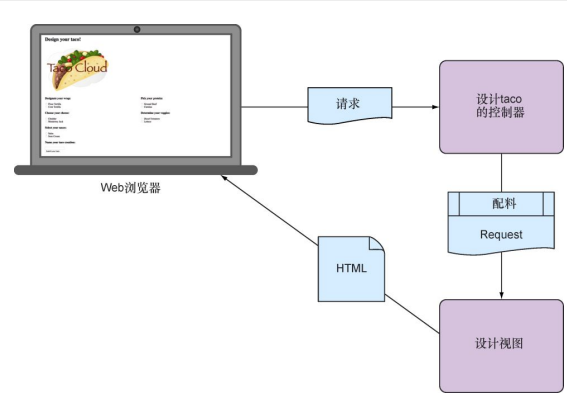

# 第二章 开发Web应用

- 在浏览器中展现模型数据
- 处理和校验表单输入
- 选择视图模板

## 1️⃣展示信息

在Spring Web应用中，获取和处理数据是控制器 的任务，而将数据渲染到HTML中并在浏览器中展现则是视图的任务。

完成创建页面需要构建如下组件：

- 用来定义taco配料的领域类
- 用来获取配料信息并将其传递给视图的Spring MVC控制器类
- 用来在用户的浏览器中渲染配料列表的视图模板



spring mvc stream

- 1️⃣构建领域类

  应用的领域指它所要解决的主题范围：也就是会影响到对应用理解的理念和概念。

  在TacoCloud应用中，包括taco设计，组成这些设计的配料，顾客以及顾客所下的订单。

  首先关注taco的配料

    - Ingredient.java

      ```java
      package online.pengpeng.tacocloud.entity;
      
      import lombok.Data;
      import lombok.RequiredArgsConstructor;
      
      @Data
      @RequiredArgsConstructor
      public class Ingredient {
          private final String id;
          private final String name;
          private final Type type;
      
          public static enum Type {
              WRAP, PROTEIN, VEGGIES, CHEESE, SAUCE
          }
      }
      ```

      这是一个普通的java类，描述了配料所需的三个属性。

      使用Lombok库在运行时动态的生成getter, setter, equals, hashCode, toString方法， [Data](https://www.notion.so/Data-035df24c19a14908b8f83a9c0250740b) 注解会告诉生成所有缺失的方法，同时对final修饰的参数使用构造器注入。lombok库不是必须的，但是可以减少编写大量无用代码的时间，同时使代码更加简洁。

- 2️⃣创建控制器类

  控制器是重要的参与者，他们主要的职责是处理HTTP请求，要么将请求传递给视图以便渲染HTML（浏览器展现），要么直接将数据写入响应体（RESTFul）。目前传递给视图的方法。

  构建一个简单的控制器，具有如下功能：

    - 处理路径为“/design”的HTTP GET请求

    - 构建配料的列表

    - 处理请求，并将配料数据传递给要渲染为HTML的视图模板，发送给发起请求的Web浏览器

    - DesignTacoController

      ```java
      package online.pengpeng.tacocloud.controller;
      
      import lombok.extern.slf4j.Slf4j;
      import online.pengpeng.tacocloud.entity.Taco;
      import org.springframework.stereotype.Controller;
      import org.springframework.ui.Model;
      import org.springframework.web.bind.annotation.GetMapping;
      import org.springframework.web.bind.annotation.RequestMapping;
      
      import java.util.Arrays;
      import java.util.List;
      import java.util.stream.Collectors;
      
      import online.pengpeng.tacocloud.entity.Ingredient;
      import online.pengpeng.tacocloud.entity.Ingredient.Type;
      
      @Slf4j
      @Controller
      @RequestMapping("/design")
      public class DesignTacoController {
      
          @GetMapping
          public  String showDesignFrom(Model model) {
              List<Ingredient> ingredients = Arrays.asList(
                      new Ingredient("FLTO", "Flour Tortilla", Type.WRAP),
                      new Ingredient("COTO", "Corn Tortilla", Type.WRAP),
                      new Ingredient("GRBF", "Ground Beef", Type.PROTEIN),
                      new Ingredient("CARN", "Carnitas", Type.PROTEIN),
                      new Ingredient("TMTO", "Diced Tomatoes", Type.VEGGIES),
                      new Ingredient("LETC", "Lettuce", Type.VEGGIES),
                      new Ingredient("CHED", "Cheddar", Type.CHEESE),
                      new Ingredient("JACK", "Monterrey Jack", Type.CHEESE),
                      new Ingredient("SLSA", "Salsa", Type.SAUCE),
                      new Ingredient("SRCR", "Sour Cream", Type.SAUCE)
              );
              Type[] types = Ingredient.Type.values();
              for (Type type:types) {
                  model.addAttribute(type.toString().toLowerCase(), filterByType(ingredients, type));
              }
              model.addAttribute("design", new Taco());
              return "design";
          }
          private List<Ingredient> filterByType(List<Ingredient> ingredients, Type type){
              return ingredients
                      .stream()
                      .filter(x->x.getType().equals(type))
                      .collect(Collectors.toList());
          }
      }
      ```

      首先注意应用级别的注解：

      [Slf4j](https://www.notion.so/Slf4j-558e7a29e2d64679bbf5972ce3e566c5) ，这是Lombok所提供的注解，在运行时， 它会自动生成一个Slf4j(Simple Logging Facade for java)Logger。这个简单的注解其实和以下代码是一致的

      ```java
      private static final org.slf4j.Logger log = org.slf4jFactory.getLogger(DesignTacoController.class);
      ```

      [Controller](https://www.notion.so/Controller-e0618ee2a4114a7b93a0660af36170cf) 会将这个类识别为控制器，并将其作为组件扫描的候选者，并将该实例作为Spring应用的上下文中的bean

      [RequestMapping](https://www.notion.so/RequestMapping-781a599393774008b1a4ecacfa8c0b1d) 注解能够指定请求的类型，或规定处理路径的匹配

      [GetMapping](https://www.notion.so/GetMapping-367ae3b0db9d49f980562144fe06fdd9) 注解其实是RequestMapping的一个快捷方法，完全可以它来代替

      ```java
      @RequestMapping(method = RequestMethod.GET)
      ```

      相同的注解还有 [PostMapping](https://www.notion.so/PostMapping-40ebf7ef814349deb99889afcbf54ffb) [PutMapping](https://www.notion.so/PutMapping-cfe79352042e4f8eb21c4d7e8ed99b6b) [DeleteMapping](https://www.notion.so/DeleteMapping-2d6aadf53c844ea0aa846e1ae6a0a24f) [PatchMapping](https://www.notion.so/PatchMappng-add017d26ace4c399704f2983dff0c7c)

      通常，只在类级别上使用@RequestMapping以便于指定基本路径

      在每个处理器方法上一般使用具体的快捷方法注解

      showDesignFrom()方法会处理请求，同时使用硬编码的方式狗构建一个Ingredient对象列表（之后从数据库中读取）。然后会根据配料类型过滤列表。然后配料类型的列表会作为属性添加到Model对象上，这个对象是由参数的形式传递给showDesignFrom()方法的。Model对象负责在控制器和展现数据的试图之间传递数据。Model属性中的数据会复制到Servlet Response的属性中，这样 视图可以使用这些数据，showDesignFrom()方法最后返回”design“，这是视图的逻辑名称。

      目前，controller层已经基本完成，如果在浏览器中访问”/design”路径, showDesignFrom()会被调用，会从repository中获取数据（那个硬编码的列表），然后请求传递视图，由于还没有定义视图，此时会遇到404错误。

- 3️⃣设计视图

  定义视图选择的是Thymeleaf方式（当然也存在其他方法，比如JSP, Groovy等）

  我们已经在pom.xml中引入了依赖

  ```xml
  <dependency>
      <groupId>org.springframework.boot</groupId>
      <artifactId>spring-boot-starter-thymeleaf</artifactId>
  </dependency>
  ```

  SpringBoot的自动配置会发现Thymeleaf子啊类路径中，然后就会创建支持Thymeleaf视图的bean

  ❓Thymeleaf如何获取Model中的数据呢：

  实际上Thymeleaf这样的视图库是与Web框架解耦的，即不能感知Spring的模型抽象，即不能调用Model中的数据。但是它可以与Servlet中的Request属性协作，所以在Spring将请求转移到视图之前，会先将数据复制到request属性中，Thymeleaf或其他视图模板就能顾访问它们。

  其实Thymeleaf就是增加了一些额外元素的HTML，这些属性能够指导模板如何渲染request数据，如果请求属性中有一个key为”message“，使用Thymeleaf来渲染它的值：

  ```html
  <p th:text="${message}">placeholder message</p>
  ```

  当模板渲染的时候, <p>元素体中的值会被替换成message对应的值

  “th:each”可以用来迭代渲染，类似于for

  ```html
  <h3>Design you wrap:</h3>
  <div th:each="ingredient:${wrap}">
  	<input name="ingredients" type="checbox" th:value="${ingredient.id}"/>
  	<span th:text="${ingredient.name}">INGREDIENT</span><br/>
  </div>
  ```

  针对wrap request属性所对应的集合中的每个元素重复渲染<div>了，在每次迭代的时候，配料元素都会绑定到一个名为ingredient的Thymeleaf变量上

  在<div>元素中，有一个<input>复选框，还有一个为复选框提供标签的<span>元素

  复选框使⽤Thymeleaf的th:value来为渲染出的<input>元素设置value属性，这⾥会将其设置为所找到的ingredient的id属性。
  <span>元素使⽤th:text将“INGREDIENT”占位符⽂本替换为ingredient的name属性

    - design.html

      ```html
      <!DOCTYPE html>
      <html lang="en"
            xmlns="http://www.w3.org/1999/xhtml"
            xmlns:th="http://www.thymeleaf.org">
      <head>
          <meta charset="UTF-8">
          <title>Taco Cloud</title>
          <link rel="stylesheet" th:href="@{/styles.css}" /> <!--TODO:可以自定义样式表，不过这不是重点，留着以后再做吧-->
      </head>
      <body>
          <h1>Design your taco!</h1>
          
      
          <form method="POST" th:object="${design}">
              <div class="grid">
                  <div class="grid">
                      <div class="ingredient-group" id="wraps">
                          <h3>Designate your wrap:</h3>
                          <div th:each="ingredient:${wrap}">
                              <input name="ingredients" type="checkbox" th:value="${ingredient.id}"/>
                              <span th:text="${ingredient.name}">INGREDIENT</span><br/>
                          </div>
                      </div>
      
                      <div class="ingredient-group" id="proteins">
                          <h3>Designate your proteins:</h3>
                          <div th:each="ingredient:${protein}">
                              <input name="ingredients" type="checkbox" th:value="${ingredient.id}"/>
                              <span th:text="${ingredient.name}">INGREDIENT</span><br/>
                          </div>
                      </div>
      
                      <div class="ingredient-group" id="cheeses">
                          <h3>Designate your cheese:</h3>
                          <div th:each="ingredient:${cheese}">
                              <input name="ingredients" type="checkbox" th:value="${ingredient.id}"/>
                              <span th:text="${ingredient.name}">INGREDIENT</span><br/>
                          </div>
                      </div>
      
                      <div class="ingredient-group" id="veggies">
                          <h3>Designate your veggies:</h3>
                          <div th:each="ingredient:${veggies}">
                              <input name="ingredients" type="checkbox" th:value="${ingredient.id}"/>
                              <span th:text="${ingredient.name}">INGREDIENT</span><br/>
                          </div>
                      </div>
      
                      <div class="ingredient-group" id="sauces">
                          <h3>Designate your sauces:</h3>
                          <div th:each="ingredient:${sauce}">
                              <input name="ingredients" type="checkbox" th:value="${ingredient.id}"/>
                              <span th:text="${ingredient.name}">INGREDIENT</span><br/>
                          </div>
                      </div>
      
                      <div>
                          <h3>Name your taco creation:</h3>
                          <input type="text" th:field="*{name}"/><br/>
                          <button>Submit your taco</button>
                      </div>
                  </div>
              </div>
          </form>
      </body>
      </html>
      ```

  TODO：可以自定义样式表

  启动程序后就可以进行配料的选择，不过此时点击提交会爆错误，因为我们还没有定义接收接口

  405错误：Request Method “POST” Not Supported）

## 2️⃣处理表单提交

视图中的<form>标签，你将会发现它的method属性被设置 成了POST，意味着当表单提交 的时候，浏览器会收集表单中的所有数据，并以HTTP POST请求的形式将其发 送⾄服务器端，发送路径与渲染表单的GET请求路径相同，也就是“/design”，现在编写⼀个新的处理器⽅法来处理针 对“/design”的POST请求

- processDesign

  ```java
  @PostMapping
  public String processDesign(Taco design) {
      // 保存taco设计方案...（之后添加）
      log.info("Processing design: " + design);
      return "redirect:/orders/current";
  }
  ```

  当表单提交的时候，表单中的输入域会绑定到Taco对象的属性中，该对象会以参数的形式传递给processDesign()，然后然后就可以对Taco对象采取操作了

- Tacos.java

  ```java
  @Data
  public class Taco {
      private String name;
      private List<String> ingredients;
  }
  ```

  表单中的多个checkbox元素的名字都是ingredients，还有名字为name的文本输入框，表单中的输入域直接对应Taco类的ingredients和name属性

与showDesignForm()⽅法类似，processDesign()最后也返回了⼀个String类型的值。同样与showDesignForm()相似，返回的这个值代表了⼀个要展现给⽤户的视图。redirect:”前缀，表明这是⼀个重定向视图，表明在processDesign()完成之后，⽤户的浏览器将会重定向到相对路 径“/order/current”

因此来创建这样一个控制器

- OrderController.java

  ```java
  @Slf4j
  @Controller
  @RequestMapping("/orders")
  public class OrderController {
      @GetMapping
      public String orderForm(Model model){
          model.addAttribute("order", new Order());
          return "orderForm";
      }
  }
  ```

- orderForm.html

  ```html
  <!DOCTYPE html>
  <html lang="en"
        xmlns="http://www.w3.org/1999/xhtml"
        xmlns:th="http://www.thymeleaf.org">
  <head>
      <meta charset="UTF-8">
      <title>Taco Cloud</title>
      <link rel="stylesheet" th:href="@{/styles.css}" />
  </head>
  <body>
      <form method="POST" th:action="@{/orders}" th:object="${order}">
          <h1>Order your taco creations!</h1>
          
          <a th:href="@{/design}" id="another">Design another taco</a><br/>
          <div th:if="${#fields.hasErrors()}">
              <span class="validationError">
                  Please correct the problems below and resubmit.
              </span>
          </div>
          <h3>Deliver my taco masterpieces to...</h3>
          <label for="name">Name: </label>
          <input type="text" th:field="*{name}"/>
          <br/>
          <label for="street">Street address: </label>
          <input type="text" th:field="*{street}"/>
          <br/>
          <label for="city">City: </label>
          <input type="text" th:field="*{city}"/>
          <br/>
          <label for="state">State: </label>
          <input type="text" th:field="*{state}"/>
          <br/>
          <label for="zip">Zip code: </label>
          <input type="text" th:field="*{zip}"/>
          <br/>
          <h3>Here's how I'll pay...</h3>
          <label for="ccNumber">Credit Card #: </label>
          <input type="text" th:field="*{ccNumber}"/>
          <br/>
          <label for="ccExpiration">Expiration: </label>
          <input type="text" th:field="*{ccExpiration}"/>
          <br/>
          <label for="ccCVV">CVV: </label>
          <input type="text" th:field="*{ccCVV}"/>
          <br/>
          <input type="submit" value="Submit order"/>
      </form>
  </body>
  </html>
  ```

<form>标签指定了⼀个表单的action,如果不指定action，那么表单将会以HTTP POST的形式提交到与展现该表单相同的URL上。在这⾥，我们明确指明表单要POST提交到“/orders”上（使⽤Thymeleaf的@{...}操作符指定相对上下⽂的路径）。


在OrderController中添加另外⼀个⽅法，以便于处理针 对“/orders”的POST请求

- processOrder

  ```java
  @PostMapping
  public String processOrder(Order order) {
      log.info("Order submitted: " + order);
      return "redirect:/";
  }
  ```

Order对象，它的属性绑定了所提交的表单域。

- Order.java

  ```java
  @Data
  public class Order {
      private String name;
      private String street;
      private String city;
      private String state;
      private String zip;
      private String ccNumber;
      private String ccExpiration;
      private String ccCVV;
  }
  ```

## 3️⃣验证表单提交

表单中输⼊域包含的可能包含不正确的信息，接下来添加⼀些校验， 确保所提交的数据⾄少和所需的信息⽐较接近。

有种校验⽅法就是在processDesign()和processOrder()⽅法中添加⼤量 乱七⼋糟的if/then代码块，逐个检查，确保每个输⼊域都满⾜对应的校验规则。但是，这样会⾮常烦琐，并且难以阅读和调试。

Spring⽀持Java的Bean校验API（Bean Validation
API，也被称为JSR-303）。能够更容易地声明检验规则，⽽不必在应⽤程序代码中显式编写声明逻辑。借助Spring Boot，要在项⽬中添加校验库，我们甚⾄不需要做任何特殊的操作，这是因为Validation API以及 Validation API 的Hibernate实现将会作为Spring Boot web starter的传递 性依赖⾃动添加到项⽬中。

Validation API 提供了⼀些可以添加到领域对象上的注解，以便于声明校验规则。

应用校验需要：

- 1️⃣在要被校验的类上声明校验规则

  对于Taco类来说，我们想要确保name属性不能为空或null，同时希望选 中的配料⾄少要包含⼀项。可以使⽤
  [NotNull](https://www.notion.so/NotNull-ef9aa411c9b846a0b4adaddbe6b30831) l和 [Size](https://www.notion.so/Size-57d96984a39d446c9963bd19823adeba) 注解来声明这些校验规则。

    - 校验Taco

      ```java
      import lombok.Data;
      import javax.validation.constraints.NotNull;
      import javax.validation.constraints.Size;
      import java.util.List;
      
      @Data
      public class Taco {
          @NotNull
          @Size(min=5, message="Name must be at least 5 characters long")
          private String name;
          @Size(min=1, message="You must choose at least 1 ingredients")
          private List<String> ingredients;
      }
      ```

  对提交的taco订单进⾏校验时确保⽤户没有提交空⽩字段。为此，可以使用 [NotBlank](https://www.notion.so/NotBlank-03c89f9ee489476b898a53545f6a88b1) 注解。ccExpiration属性必须符合MM/YY格式（两位的⽉份和年份）。ccCVV属性需要是⼀个3位的数 字。为了实现这种校验，我们需要其他的⼀些Java Bean Validation API注 解，并结合来⾃Hibernate Validator的注解：

  [`Digits`](https://www.notion.so/Digits-6e3ffe3232e54c408f01d5b557833b57) [Pattern](https://www.notion.so/Pattern-dfa78f055564437884853f0aff692fdf) [`CreditCardNumber`](https://www.notion.so/CreditCardNumber-e26814b10c08423490b6e1a519a8e300)

    - 校验Order

      ```java
      import lombok.Data;
      import org.hibernate.validator.constraints.CreditCardNumber;
      import javax.validation.constraints.Digits;
      import javax.validation.constraints.NotBlank;
      import javax.validation.constraints.Pattern;
      
      @Data
      public class Order {
          @NotBlank(message = "Name is required")
          private String name;
          @NotBlank(message = "street is required")
          private String street;
          @NotBlank(message = "city is required")
          private String city;
          @NotBlank(message = "state is required")
          private String state;
          @NotBlank(message = "zip is required")
          private String zip;
      
          @CreditCardNumber(message = "Not a valid credit card number")
          private String ccNumber;
      
          @Pattern(regexp = "!(0[1-9]|1[0-2])([\\/])([1-9][0-9])$", message = "Must be formatted MM/YY")
          private String ccExpiration;
      
          @Digits(integer = 3, fraction = 0, message = "Invalid CVV")
          private String ccCVV;
      }
      ```

- 2️⃣在控制器方法中申明要进行的校验

  重新修改每 个控制器，让表单在POST提交⾄对应的控制器⽅法时执⾏对应的校验。

  要校验提交的Taco，我们需要为DesignTacoController中processDesign()⽅法的Taco参数添加⼀个Java Bean Validation API的@Valid注解

  @Valid 注解会告诉Spring MVC  要对提交的 Taco 对象进⾏校验，⽽校验时 机是在它绑定完表单数据之后、调⽤processDesign()之前

  如果存在校验错 误，那么这些错误的细节将会捕获到⼀个Errors对象中并传递给
  processDesign(）

  ```java
  @PostMapping
  public String processDesign(@Valid Taco design, Errors errors) {
      if (errors.hasErrors()){
          if (errors.hasErrors()){
              return "design";
  //            return showDesignFrom(model);
          }
      }
      // 保存taco设计方案...（之后添加）
      log.info("Processing design: " + design);
      return "redirect:/orders/current";
  }
  ```

  （只能说，design的检验出错就返回不了，应该是与它在model中添加了调料列表有关，但是如果调用一下showDesignFrom的话，错误信息就没有了，这里可能最好把调料列表和表单分开比较好。processOrder是没问题的）

  OrderController的processOrder()
  ⽅法也需要进⾏类似的变更

  ```java
  @PostMapping
  public String processOrder(@Valid Order order, Errors errors) {
      if (errors.hasErrors()){
          return "current";
      }
      log.info("Order submitted: " + order);
      return "redirect:/";
  }
  ```

- 3️⃣修改表单视图以展示校验错误

  Thymeleaf提供了便捷访问Errors对象的⽅法，这就是借助fields及其th:errors属性。

  举例来说，为了展现信⽤卡字段的校验错误，我们可以添加⼀ 个<span>元素，该元素会将对错误的引⽤⽤到订单的表单模板上

  ```html
  <label for="ccNumber">Credit Card #: </label>
  <input type="text" th:field="*{ccNumber}"/>
  <span class="validationError"
   th:if="${#fields.hasErrors('ccNumber')}"
   th:errors="*{ccNumber}">CC Num Error</span>
  ```

    - current.html

      ```html
      <!DOCTYPE html>
      <html lang="en"
            xmlns="http://www.w3.org/1999/xhtml"
            xmlns:th="http://www.thymeleaf.org">
      <head>
          <meta charset="UTF-8">
          <title>Taco Cloud</title>
          <link rel="stylesheet" th:href="@{/styles.css}" />
      </head>
      <body>
          <form method="POST" th:action="@{/orders}" th:object="${order}">
              <h1>Order your taco creations!</h1>
              
              <a th:href="@{/design}" id="another">Design another taco</a><br/>
              <div th:if="${#fields.hasErrors()}">
                  <span class="validationError">
                      Please correct the problems below and resubmit.
                  </span>
              </div>
              <h3>Deliver my taco masterpieces to...</h3>
              <label for="name">Name: </label>
              <input type="text" th:field="*{name}"/>
              <sapn class="validationError"
                    th:if="${#fields.hasErrors('name')}"
                    th:errors="*{name}">
                  name Error
              </sapn>
              <br/>
      
              <label for="street">Street address: </label>
              <input type="text" th:field="*{street}"/>
              <sapn class="validationError"
                    th:if="${#fields.hasErrors('street')}"
                    th:errors="*{street}">
                  street Error
              </sapn>
              <br/>
      
              <label for="city">City: </label>
              <input type="text" th:field="*{city}"/>
              <sapn class="validationError"
                    th:if="${#fields.hasErrors('city')}"
                    th:errors="*{city}">
                  city Error
              </sapn>
              <br/>
      
              <label for="state">State: </label>
              <input type="text" th:field="*{state}"/>
              <sapn class="validationError"
                    th:if="${#fields.hasErrors('state')}"
                    th:errors="*{state}">
                  state Error
              </sapn>
              <br/>
      
              <label for="zip">Zip code: </label>
              <input type="text" th:field="*{zip}"/>
              <sapn class="validationError"
                    th:if="${#fields.hasErrors('zip')}"
                    th:errors="*{zip}">
                  zip Error
              </sapn>
              <br/>
      
              <h3>Here's how I'll pay...</h3>
              <label for="ccNumber">Credit Card #: </label>
              <input type="text" th:field="*{ccNumber}"/>
              <sapn class="validationError"
                    th:if="${#fields.hasErrors('ccNumber')}"
                    th:errors="*{ccNumber}">
                  CC Num Error
              </sapn>
              <br/>
      
              <label for="ccExpiration">Expiration: </label>
              <input type="text" th:field="*{ccExpiration}"/>
              <sapn class="validationError"
                    th:if="${#fields.hasErrors('ccExpiration')}"
                    th:errors="*{ccExpiration}">
                  ccExpiration Error
              </sapn>
              <br/>
      
              <label for="ccCVV">CVV: </label>
              <input type="text" th:field="*{ccCVV}"/>
              <sapn class="validationError"
                  th:if="${#fields.hasErrors('ccCVV')}"
                  th:errors="*{ccCVV}">
                  ccCVV Error
              </sapn>
              <br/>
              <input type="submit" value="Submit order"/>
          </form>
      </body>
      </html>
      ```

  <span>元素使⽤class属性来为错误添加样式，以引起⽤户的注意。使⽤th:if属性来决定是否要显⽰该元素,th:errors属性引⽤了ccNumber输⼊域，如果该输⼊域存在错误，那么它 会将<span>元素的占位符内容替换为校验信息。

## 4️⃣使用视图控制器

大多数的控制器都遵行相同的编程模型：

- 使⽤了@Controller注解，表明它们是控制器类，应该被Spring的组件扫描功能⾃动发现并初始化为Spring应⽤上下⽂中的bean；
- 在类级别使⽤了@RequestMapping注解，据此定义该控制器所处理的基本请求模式；
- 它们都有⼀个或多个带@GetMapping或@PostMapping注解的⽅法，指明了该由哪个⽅法来处理某种类型的请求。

如果⼀个控制器⾮常简单（homeController），不需要填充模型或处理输⼊还有⼀种⽅式可以定义控制器：

```java
import org.springframework.context.annotation.Configuration;
import org.springframework.web.servlet.config.annotation.ViewControllerRegistry;
import org.springframework.web.servlet.config.annotation.WebMvcConfigurer;

@Configuration
public class WebConfig implements WebMvcConfigurer {

    @Override
    public void addViewControllers(ViewControllerRegistry registry) {
        registry.addViewController("/").setViewName("home");
    }
}
```

WebConfig现了WebMvcConfigurer接⼝,WebMvcConfigurer定义了多个⽅法来配置Spring MVC。它提供了所有⽅法的默认实现，可以覆盖所需的⽅法来执行自己的逻辑。

addViewControllers()⽅法会接收⼀个ViewControllerRegistry对象， 我们可以使⽤它注册⼀个或多个视图控制器。在这⾥，我们调⽤registry的addViewController()⽅法，将“/”传递了进去，视图控制器将会针对该路径执 ⾏GET请求。这个⽅法会返回ViewControllerRegistration对象，我们⻢上基 于该对象调⽤setViewName()⽅法，⽤它指明当请求“/”的时候要转发 到“home”视图上。

可以删除HomeController了

## 5️⃣选择视图模板库

在⼤多数情况下，视图模板库的选择完全取决于个⼈喜好。Spring⾮常灵 活，能够⽀持很多常⻅的模板⽅案。除了个别情况之外，你所选择的模板库本 ⾝甚⾄不知道它在与Spring协作

禁用Thymeleaf缓存

注意：在部署到生产环境之前，一定要删去

```
spring.thymeleaf.cache=false
```

当然，更好的方法是使用DevTools

## 🈴小结

- Spring提供了⼀个强⼤的Web框架，名为Spring MVC，能够⽤来为Spring应⽤开发Web前端。
- Spring MVC是基于注解的，通过像@RequestMapping、@GetMapping
  和@PostMapping这样的注解来启⽤请求处理⽅法的声明。
- ⼤多数的请求处理⽅法最终会返回⼀个视图的逻辑名称，⽐如Thymeleaf模板，请求会转发到这样的视图上（同时会带有任意的模型数据）。
- Spring MVC⽀持校验，这是通过Java Bean Validation API和 Validation API的实现（如Hibernate Validator）完成的。
- 对于没有模型数据和逻辑处理的HTTP GET请求，可以使⽤视图控制器。
- 除了Thymeleaf之外，Spring⽀持各种视图⽅案，包括FreeMarker、Groovy Templates和Mustache。