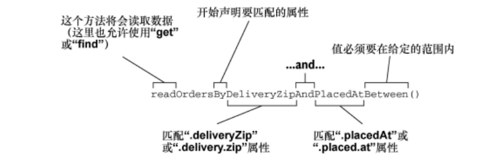

# 第三章 使用数据

> 使用Spring 的jdbcTemplate
> 使用SimpleJdbcInsert插入数据
> 使用SpringData声明JPA repository

## 1️⃣使用JDBC读取和写入数据

尽管近年来涌现了许多可选的数据库类型，但是关系型数据库依然是通用数据库存储的首选。

处理关系型数据库的时候，Java开发人员有多种可选方案，其中最常见的是JDBC和JPA。Spring两种的都支持并做了相应的简化。Spring对JDBC的封装是JDBC template：

在不使用JDBCTemplate的情况下执行一个简单的查询：

- findOne

  ```java
  @Override 
  public Ingredient findOne(String id){
  	 Connection connection = null;
  	 PreparedStatement statement = null;
  	 ResultSet resultSet = null;
  	 try {
  		 connection = dataSource.getConnection();
  		 statement = connection.prepareStatement(
  			 "select id, name, type from Ingredient where id=?");
  		 statement.setString(1, id);
  		 resultSet = statement.executeQuery();
  		 Ingredient ingredient = null;
  		 if(resultSet.next()) {
  			 ingredient = new Ingredient(
  			 resultSet.getString("id"),
  			 resultSet.getString("name"),
  			 Ingredient.Type.valueOf(resultSet.getString("type")));
  		 }
  		 return ingredient;
  	 } catch (SQLException e) {
  	 // ??? What should be done here ???
  	 } finally {
  		 if (resultSet != null) {
  		 try {
  			 resultSet.close();
  		 } catch (SQLException e) {}
  	 }
  	 if (statement != null) {
  	 try {
  	 statement.close();
  	 } catch (SQLException e) {}
  	 }
  	 if (connection != null) {
  	 try {
  	 connection.close();
  	 } catch (SQLException e) {}
  	 }
  	 }
   return null;
  }
  ```

使用常规的JDBC代码，必须自己编写代码来实现创建连接，创建语句，以及关闭连接，语句和结果集的清理功能完全包围起来。（尽管这些代码是十分重要的，但是它在大多数情况下都是重复的，所以没有必要反复编写同样的代码）

使用jdbcTemplate来达到相同的作用

- findOne

  ```java
  private JdbcTemplate jdbc;
  
  @Override
  public Ingredient findOne(String id){
  	return jdbc.queryForObject(
  	"select id , name, type from Ingredient where id="?", this::mapRowToIngredient, id);
  }
  
  private Igredient mapRowToIngredient(ReslutSet rs, int rowNum) throws SQLException{
  	return new Ingredient(rs.getString("id"), rs.getString("name"), Ingredient.Type.valueOf(valueOf(rs.getString("type")));
  }
  ```

使用jdbcTemplate之后，我们无需手动的去创建连接和关闭连接和异常检查，只需要关注业务功能就可以了。

- 1️⃣调整领域模型对象以适应持久化

  在将对象持久化到数据库的时候，一般需要一个id，所以在Taco和Order类中需要加上一个id字段，同时Taco和Order最好加上一个创建的时间和日期

  ```java
  private Long id;
  private Date createdAt;
  ```

  （使用lombok的好处就是修改了类的字段之后不需要再手动的更新getter或setter方法）

- 2️⃣使用jdbcTemplate

  在使用jdbcTemplate之前，需要首先将它添加到项目的类路径中。

  ```xml
  <dependency>
  	<groupId>org.springframework.boot</groupId>
  	<artifactId>spring-boot-starter-jdbc</artifactId>
  </dependency>
  ```

  使用一个嵌入式式的数据库，H2数据库(在开发阶段使用完全足够)

  ```xml
  <dependency>
  	<groupId>com.h2database</groupId>
  	<artifactId>h2</artifactId>
  	<scope>runtime</scope>
  </dependency>
  ```

  定义JDBC repository

  Ingredient repository需要完成以下功能：

    - 查询所有配料信息，并放到一个Ingredient对象的集合中。
    - 根据id，查询单个Ingredient
    - 保存Ingredient对象

  声明IngredientRepository接口及其方法：

    - IngredientRepository.java

      ```java
      package online.pengpeng.tacocloud.repository;
      
      import online.pengpeng.tacocloud.entity.Ingredient;
      import org.springframework.beans.factory.annotation.Autowired;
      import org.springframework.jdbc.core.JdbcTemplate;
      import org.springframework.stereotype.Repository;
      
      @Repository
      public class JdbcIngredientRepository implements IngredientRepository{
      
          private JdbcTemplate jdbc;
      
          @Autowired
          public JdbcIngredientRepository(JdbcTemplate jdbc) {
              this.jdbc = jdbc;
          }
          // ...
      }
      ```

      JdbcIngredientRepository添加了 [Repository](https://www.notion.so/Repository-7d8b28ac9acd4af48cf4380b8fef1d2c) 注解，这是Spring定义的一系列构造型(Stereo)注解

      当Spring创JdbcIngredientRepository bean的 时候，他会通过 [Autowired](https://www.notion.so/Autowired-b1907e552c0647f09e6922e42040022b) 标注的构造器将jdbcTemplate注入进来，然后可以被其它方法使用。

        - findOne() findAll()

          ```java
          @Override
          public Iterable<Ingredient> findAll() {
              return jdbc.query("select id, name, type from Ingredient", this::mapRowToIngredient);
          }
          
          @Override
          public Ingredient findOne(String id) {
              return jdbc.queryForObject("select id, name, type from Ingredient where id=?", this::mapRowToIngredient, id);
          }
          
          private Ingredient mapRowToIngredient(ResultSet rs, int rowNum) throws SQLException {
              return new Ingredient(rs.getString("id"), rs.getString("name"), Ingredient.Type.valueOf(rs.getString("type")));
          }
          ```

      findAll()⽅法预期返回⼀个对象的集合，它使⽤了JdbcTemplate的query()⽅法。query()会接受要执⾏的SQL以及Spring RowMapper的⼀个实现（⽤来将结果集中的每⾏数据映射为⼀个对象）

      findOne()⽅法预期只会返回⼀个Ingredient对象，所以它使⽤了
      JdbcTemplate的queryForObject()⽅法，⽽不是query()⽅法。queryForObject()⽅法返回⼀个对象，⽽不是对象的List。

      当然，如果RowMapper只会被使用一次,那么推荐使用lambda表达式来化简,如下

        - findOne lambda

          ```java
          @Override
          public Ingredient findOne(String id) {
               return jdbc.queryForObject(
                       "select id, name, type from Ingredient where id=?",
                           new RowMapper<Ingredient>() {
                           public Ingredient mapRow(ResultSet rs, int rowNum)
                           throws SQLException {
                               return new Ingredient(
                                   rs.getString("id"),
                                   rs.getString("name"),
                                   Ingredient.Type.valueOf(rs.getString("type")));
                           };
                   }, id);
          }
          ```

      插入一条数据

        - save()

          ```java
          @Override
          public Ingredient save(Ingredient ingredient) {
              jdbc.update(
                      "insert into Ingredient (id, name, type) values (?, ?, ?)",
                      ingredient.getId(),
                      ingredient.getName(),
                      ingredient.getType().toString());
              return ingredient;
          }
          ```

          update方法不需要设置结果映射ResultSet，只需要⼀个包含待 执⾏SQL的String以及每个查询参数对应的值即可

      JdbcIngredientRepository编写完成之后，我们就可以将其注⼊DesignTacoController中了，然后使⽤它来提供Ingredient对象的 列表，不⽤再使⽤硬编码的值

        - DesignTacoController

          ```java
          @Slf4j
          @Controller
          @RequestMapping("/design")
          public class DesignTacoController {
          
              private final IngredientRepository ingredientRepository;
          
              @Autowired
              public DesignTacoController(IngredientRepository ingredientRepository){
                  this.ingredientRepository = ingredientRepository;
              }
          
              @GetMapping
              public  String showDesignFrom(Model model) {
                  List<Ingredient> ingredients = new ArrayList<>();
                  ingredientRepository.findAll().forEach(i -> ingredients.add(i));
                  Type[] types = Ingredient.Type.values();
                  for (Type type:types) {
                      model.addAttribute(type.toString().toLowerCase(), filterByType(ingredients, type));
                  }
                  model.addAttribute("design", new Taco());
                  return "design";
          //...
          }
          ```

      findAll()⽅法会从数据库中 获取所有的配料，并将它们过滤成不同的类型，然后放到模型中。

- 3️⃣定义模式和预加载数据

  除了Ingredient表之外，还需要其他的⼀些表来保存订单和设计信息

  

  Ingredient：保存配料信息。 Taco：保存taco设计相关的信息。 Taco_Ingredients：Taco中的每⾏数据都对应⼀⾏或多⾏，将
  taco和与之相关的配料映射在⼀起。 Taco_Order：保存必要的订单细节。 Taco_Order_Tacos：Taco_Order中的每⾏数据都对应⼀⾏或多⾏将订单和与之相关的taco映射在⼀起。

    - src/main/resources/schema.sql

      ```sql
      create table if not exists Ingredient(
          id varchar(4) not null,
          name varchar(25) not null,
          type varchar(10) not null
      );
      
      create table if not exists Taco (
          id identity,
          name varchar(50) not null,
          createdAt timestamp not null
      );
      
      create table if not exists Taco_Ingredients (
          taco bigint not null,
          ingredient varchar(4) not null
      );
      
      alter table Taco_Ingredients
          add foreign key (taco) references Taco(id);
      alter table Taco_Ingredients
          add foreign key (ingredient) references Ingredient(id);
      
      create table if not exists Taco_Order (
          id identity,
          Name varchar(50) not null,
          Street varchar(50) not null,
          City varchar(50) not null,
          State varchar(2) not null,
          Zip varchar(10) not null,
          ccNumber varchar(16) not null,
          ccExpiration varchar(5) not null,
          ccCVV varchar(3) not null,
          placedAt timestamp not null
      );
      
      create table if not exists Taco_Order_Tacos (
          tacoOrder bigint not null,
          taco bigint not null
      );
      
      alter table Taco_Order_Tacos
          add foreign key (tacoOrder) references Taco_Order(id);
      alter table Taco_Order_Tacos
          add foreign key (taco) references Taco(id);
      ```

  如果在应⽤的根类路径下存在名为schema.sql的⽂件，那么在应 ⽤启动的时候将会基于数据库执⾏这个⽂件中的SQL

    - src/main/resources/data.sql

      ```sql
      delete from Taco_Order_Tacos;
      delete from Taco_Ingredients;
      delete from Taco;
      delete from Taco_Order;
      delete from Ingredient;
      insert into Ingredient (id, name, type)
      values ('FLTO', 'Flour Tortilla', 'WRAP');
      insert into Ingredient (id, name, type)
      values ('COTO', 'Corn Tortilla', 'WRAP');
      insert into Ingredient (id, name, type)
      values ('GRBF', 'Ground Beef', 'PROTEIN');
      insert into Ingredient (id, name, type)
      values ('CARN', 'Carnitas', 'PROTEIN');
      insert into Ingredient (id, name, type)
      values ('TMTO', 'Diced Tomatoes', 'VEGGIES');
      insert into Ingredient (id, name, type)
      values ('LETC', 'Lettuce', 'VEGGIES');
      insert into Ingredient (id, name, type)
      values ('CHED', 'Cheddar', 'CHEESE');
      insert into Ingredient (id, name, type)
      values ('JACK', 'Monterrey Jack', 'CHEESE');
      insert into Ingredient (id, name, type)
      values ('SLSA', 'Salsa', 'SAUCE');
      insert into Ingredient (id, name, type)
      values ('SRCR', 'Sour Cream', 'SAUCE');
      ```

- 4️⃣插入数据

  借助JdbcTemplate，有以下两种保存数据的⽅法。 直接使⽤update()⽅法。 使⽤SimpleJdbcInsert包装器类：

  ```java
  public interface TacoRepository {
      Taco save(Taco design);
  }
  ```

  ```java
  public interface OrderRepository {
      Order save(Order order);
  }
  ```

  保存taco的时候需要同时将与该taco关联的配料保存到Taco_Ingredients表中。与之类似，保存订单 的时候，需要同时将与该订单关联的taco保存到Taco_Order_Tacos表中。

  为了实现TacoRepository，我们需要⽤save()⽅法⾸先保存必要 的taco设计细节（⽐如，名称和创建时间），然后对Taco对象中的每 种配料都插⼊⼀⾏数据到Taco_Ingredients中。

    - jdbcTacoRepository.java

      ```java
      package online.pengpeng.tacocloud.repository;
      
      import online.pengpeng.tacocloud.entity.Taco;
      import org.springframework.beans.factory.annotation.Autowired;
      import org.springframework.jdbc.core.JdbcTemplate;
      import org.springframework.jdbc.core.PreparedStatementCreator;
      import org.springframework.jdbc.core.PreparedStatementCreatorFactory;
      import org.springframework.jdbc.core.simple.SimpleJdbcInsert;
      import org.springframework.jdbc.support.GeneratedKeyHolder;
      import org.springframework.jdbc.support.KeyHolder;
      import org.springframework.stereotype.Repository;
      
      import java.sql.*;
      import java.util.Arrays;
      import java.util.Date;
      import java.util.HashMap;
      import java.util.Map;
      
      @Repository
      public class JdbcTacoRepository implements TacoRepository{
      
          private JdbcTemplate jdbc;
      
          private SimpleJdbcInsert tacoInserter;
      
          @Autowired
          public JdbcTacoRepository (JdbcTemplate jdbc) {
              this.jdbc = jdbc;
              this.tacoInserter = new SimpleJdbcInsert(jdbc)
                      .withTableName("Taco")
                      .usingGeneratedKeyColumns("id");
          }
      
          @Override
          public Taco save(Taco taco) {
      //        long tacoId = saveTacoInfo(taco); // 这种方法一直不成功，我也不知道原因
              long tacoId = saveTacoInfoSimple(taco);
              taco.setId(tacoId);
              for (String ingredient : taco.getIngredients()) {
                  saveIngredientToTaco(ingredient, tacoId);
              }
              return taco;
          }
      
          private long saveTacoInfo(Taco taco) {
              taco.setCreatedAt(new Date());
              PreparedStatementCreator psc = new PreparedStatementCreatorFactory(
                      "insert into Taco (name, createdAt) values (?, ?)",
                      Types.VARCHAR,
                      Types.TIMESTAMP)
                      .newPreparedStatementCreator(
                          Arrays.asList(
                              taco.getName(),
                              new Timestamp(taco.getCreatedAt().getTime())
                      )
                      );
              KeyHolder keyHolder = new GeneratedKeyHolder();
              jdbc.update(psc, keyHolder);
              return keyHolder.getKey().longValue();
          }
      
          private long saveTacoInfoSimple(Taco taco){
              taco.setCreatedAt(new Date());
              Map<String, Object> values = new HashMap<>();
              values.put("name", taco.getName());
              values.put("createdAt", new Timestamp(taco.getCreatedAt().getTime()));
              int id = tacoInserter.execute(values);
              return id;
          }
      
          private void saveIngredientToTaco(String ingredient, long tacoId){
              jdbc.update(
                      "insert into Taco_Ingredients (taco, ingredient) values (?, ?)",
                      tacoId,
                      ingredient
              );
          }
      }
      ```

  save()⽅法⾸先调⽤了私有的saveTacoInfo()⽅ 法，然后使⽤该⽅法所返回的taco ID来调⽤saveIngredientToTaco()，最后的这个⽅法会保存每种配料。这⾥的 问题在于saveTacoInfo()⽅法的细节

  当向Taco中插⼊⼀⾏数据的时候，我们需要知道数据库⽣成的ID，这样我们才可以在每个配料信息中引⽤它。保存配料数据时所使⽤ 的update()⽅法⽆法帮助我们得到所⽣成的ID，所以在这⾥我们需要 ⼀个不同的update()⽅法。 这⾥的update()⽅法需要接受⼀个PreparedStatementCreator和⼀个KeyHolder。KeyHolder将会为我们提供⽣成的taco ID。但是， 为了使⽤该⽅法，我们必须还要创建PreparedStatementCreator。

  将TacoRepository注入到DesignTacoController中，并在保存taco的时候调用它。

    - DesignTacoController注入TacoRepository

      ```java
      private final TacoRepository designRepository;
      
      @Autowired
      public DesignTacoController(IngredientRepository ingredientRepository, TacoRepository designRepository){
          this.ingredientRepository = ingredientRepository;
          this.designRepository = designRepository;
      }
      ```

    - 新的processDesign()方法

      ```java
      @Slf4j
      @Controller
      @RequestMapping("/design")
      @SessionAttributes("order")
      public class DesignTacoController {
      
          @ModelAttribute(name = "order")
          public Order order(){
              return new Order();
          }
      
          @ModelAttribute(name = "taco")
          public Taco taco(){
              return new Taco();
          }
          @PostMapping
          public String processDesign(
                  @Valid Taco design, Errors errors,
                  @ModelAttribute Order order) {
              if (errors.hasErrors()){
                  log.error(errors.toString());
                  return "design";
              }
              Taco saved = designRepository.save(design);
              order.addDesign(saved);
              return "redirect:/orders/orderForm";
          }
      // ...
      }
      ```

    - 在order中也增加了一个字段和方法

      ```java
      private List<Taco> tacos;
      public void addDesign(Taco taco){
          if (tacos == null){
              tacos = new ArrayList<>();
          }
          tacos.add(taco);
      }
      ```

  DesignTacoController类添加了 [SessionAttributes](https://www.notion.so/SessionAttributes-619f8176d89847ad931d91bb0062a7f7) ("order")注 解, 以及 [ModelAttribute](https://www.notion.so/ModelAttribute-33798f2693c44ee3820f9ab24fec1cb7) 注解

  order()⽅法上的@ModelAttribute注解能够确保会在模型中创建⼀个Order对象。与模型中的Taco对象不 同，我们需要订单信息在多个请求中都能出现，这样的话我们就能创建 多个taco并将它们添加到该订单中。类级别的@SessionAttributes能 够指定模型对象（如订单属性）要保存在session中，这样才能跨请求使⽤。

  对taco设计的处理位于processDesign()⽅法中。该⽅法接受Order对象作为参数，同时还包括Taco和Errors对象。Order参数带有
  @ModelAttribute注解，表明它的值应该是来⾃模型的，SpringMVC不会尝试将请求参数绑定到它上⾯。

  之前在在保存Taco获取id时，通过 KeyHolder和PreparedStatementCreator获取的步骤十分繁琐，我们可以使用⼊SimpleJdbcInsert更容易地将数据插⼊到表中：

  创建⼀个JdbcOrderRepository，在构造器中创建SimpleJdbcInsert的两个实例，分别⽤来把值插⼊到Taco_Order和Taco_Order_Tacos表中

    - JdbcOrderRepository

      ```java
      @Repository
      public class JdbcOrderRepository implements OrderRepository{
      
          private SimpleJdbcInsert orderInserter;
          private SimpleJdbcInsert orderTacoInserter;
          private ObjectMapper objectMapper;
      
          @Autowired
          public JdbcOrderRepository (JdbcTemplate jdbc) {
              this.orderInserter = new SimpleJdbcInsert(jdbc)
                      .withTableName("Taco_Order")
                      .usingGeneratedKeyColumns("id");
              this.orderTacoInserter = new SimpleJdbcInsert(jdbc)
                      .withTableName("Taco_Order_Tacos");
              this.objectMapper = new ObjectMapper();
          }
      
         @Override
          public Order save(Order order) {
              order.setPlaceAt(new Date());
              long orderId = saveOrderDetails(order);
              order.setId(orderId);
              List<Taco> tacos = order.getTacos();
              for (Taco taco : tacos) {
                  saveTacoToOrder(taco, orderId);
              }
              return order;
          }
      
          private long saveOrderDetails(Order order) {
              @SuppressWarnings("unchecked")
              Map<String, Object> values = objectMapper.convertValue(order, Map.class);
              values.put("placedAt", order.getPlaceAt());
              long orderId = orderInserter.executeAndReturnKey(values).longValue();
              return orderId;
          }
      
          private void saveTacoToOrder(Taco taco, long orderId) {
              Map<String, Object> values = new HashMap<>();
              values.put("tacoOrder", orderId);
              values.put("taco", taco.getId());
              orderTacoInserter.execute(values);
          }
      
      }
      ```

  使用JdbcTemplate构建了两个SimpleJdbcInsert实例，

  第⼀个实例赋值给了orderInserter实例变量，配置为与Taco_Order
  表协作，并且假定id属性将会由数据库提供或⽣成。第⼆个实例赋值给
  了orderTacoInserter实例变量，配置为与Taco_Order_Tacos表协 作，但是没有声明该表中ID是如何⽣成的。

  创建了Jackson中ObjectMapper类的⼀个实例，并将 其赋值给⼀个实例变量。尽管Jackson的初衷是进⾏JSON处理，但也可以使⽤它来帮助保存订单和关联的taco。

  save()⽅法实际上没有保存任何内容，只是定义了保存Order及其 关联的Taco对象的流程，并将实际的持久化任务委托给了
  saveOrderDetails()和saveTacoToOrder()

  使⽤Jackson的ObjectMapper及其convertValue()⽅法，以便于将Order转换为
  Map

  将OrderRepository注⼊到OrderController中并 开始使⽤

    - OrderController

      ```java
      package online.pengpeng.tacocloud.controller;
      
      import lombok.extern.slf4j.Slf4j;
      import online.pengpeng.tacocloud.entity.Order;
      import online.pengpeng.tacocloud.repository.OrderRepository;
      import org.springframework.beans.factory.annotation.Autowired;
      import org.springframework.stereotype.Controller;
      import org.springframework.ui.Model;
      import org.springframework.validation.Errors;
      import org.springframework.web.bind.annotation.*;
      import org.springframework.web.bind.support.SessionStatus;
      
      import javax.validation.Valid;
      
      @Slf4j
      @Controller
      @RequestMapping("/orders")
      @SessionAttributes("order")
      public class OrderController {
      
          private OrderRepository orderRepo;
      
          @Autowired
          public OrderController(OrderRepository orderRepo) {
              this.orderRepo = orderRepo;
          }
      
          @GetMapping("/orderForm")
          public String orderForm(@ModelAttribute Order order){
              return "current";
          }
      
          @PostMapping
          public String processOrder(
      //            @Valid // 推荐写代码时把验证关上，使用时才启动 TODO
                  @ModelAttribute Order order,
                  Errors errors,
                  SessionStatus sessionStatus) {
              if (errors.hasErrors()){
                  return "current";
              }
              orderRepo.save(order);
              sessionStatus.setComplete();
              return "redirect:/";
          }
      }
      ```

  除了将OrderRepository注⼊到控制器中，OrderController唯⼀ 明显的变化就是processOrder()⽅法。

  由于我们使用的是在session中传过来的order model所以，getMapping时不需要new一个新的实例了

  在这个⽅法中，通过表单提交 的Order对象（同时也是session中持有的Object对象）会通过注⼊的
  OrderRepository的save()⽅法进⾏保存。

  订单保存完成之后，我们就不需要在session中持有它了。实际 上，如果我们不把它清理掉，那么订单会继续保留在session中，其中 包括与之关联的taco，下⼀次的订单将会从旧订单中保存的taco开始。

  processOrder()⽅法请求了⼀个SessionStatus参数，并 调⽤了它的setComplete()⽅法来重置session。

  可以在浏览器中访[http://localhost:8080/h2-console](http://localhost:8080/h2-console)以查看H2 Console

## 2️⃣使用Spring Data JPA持久化数据

Spring Data是⼀个⾮常⼤的伞形项⽬，由多个⼦项⽬组成，其中 ⼤多数⼦项⽬都关注对不同的数据库类型进⾏数据持久化。⽐较流⾏的 ⼏个Spring Data项⽬包括：

- Spring Data JPA：基于关系型数据库进⾏JPA持久化。

- Spring Data MongoDB：持久化到Mongo⽂档数据库。

- Spring Data Neo4j：持久化到Neo4j图数据库。

- Spring Data Redis：持久化到Redis key-value存储。

- Spring Data Cassandra：持久化到Cassandra数据库。

- 1️⃣添加SpringDataJPA到项目中

  Spring Boot应⽤可以通过JPA starter来添加Spring Data JPA。 这个starter依赖不仅会引⼊Spring Data JPA，还会传递性地将Hibernate作为JPA实现引⼊进来

  ```xml
  <dependency>
      <groupId>org.springframework.boot</groupId>
      <artifactId>spring-boot-starter-data-jpa</artifactId>
  </dependency>
  ```

  如果想要使用不同那个JPA实现，那么需要先将Hibernate依赖排除出去并将选择的JPA库包含进来

    - 使用EclipseLink代替Hibernate

      ```xml
      <groupId>org.springframework.boot</groupId>
           <artifactId>spring-boot-starter-data-jpa</artifactId>
           <exclusions>
               <exclusion>
                   <artifactId>hibernate-entitymanager</artifactId>
                   <groupId>org.hibernate</groupId>
               </exclusion>
           </exclusions>
          </dependency>
          <dependency>
           <groupId>org.eclipse.persistence</groupId>
           <artifactId>eclipselink</artifactId>
           <version>2.5.2</version>
      </dependency>
      ```

- 2️⃣将领域对象标注为实体

    - Ingredient

      ```java
      package online.pengpeng.tacocloud.entity;
      
      import lombok.AccessLevel;
      import lombok.Data;
      import lombok.NoArgsConstructor;
      import lombok.RequiredArgsConstructor;
      
      import javax.persistence.Entity;
      import javax.persistence.Id;
      
      @Data
      @RequiredArgsConstructor
      @NoArgsConstructor(force=true)
      @Entity
      public class Ingredient {
          @Id
          private final String id;
          private final String name;
          private final Type type;
      
          public static enum Type {
              WRAP, PROTEIN, VEGGIES, CHEESE, SAUCE
          }
      }
      ```

  为了将Ingredient声明为JPA实体，它必须添加 [Entity](https://www.notion.so/Entity-5181547376c7450595fb335764c9c6e5) 注解，它的id属性需要使用 [Id](https://www.notion.so/Id-dbe46874603f414b97f1dc67df778b09) 注解，以便于将其指定为数据库中唯一标识该实体的属性。

  [NoArgsConstructor](https://www.notion.so/NoArgsConstructor-9d317b2bda5a4be7863122ef32ab860f) 用来为JPA添加一个无参的构造器，并可以通过设置access属性为AccessLevel.PRIVATE将其变成私有的（这里不需要），同时设置fore为true来保证final属性能正确注入。 [Data](https://www.notion.so/Data-035df24c19a14908b8f83a9c0250740b) 会自动为我们添加一个有参构造函数，但是如果添加了  NoArgsConstructor之后就会自动取消（和java默认的构造函数一样），所以如果需要有参构造需要添加一个 [RequiredArgsConstructor](https://www.notion.so/RequiredArgsConstructor-1b459e65d7d7426bbbb92bd806e6c985)

    - Taco

      ```java
      package online.pengpeng.tacocloud.entity;
      
      import lombok.Data;
      import lombok.Generated;
      import org.hibernate.metamodel.model.convert.spi.JpaAttributeConverter;
      
      import javax.persistence.*;
      import javax.validation.constraints.NotNull;
      import javax.validation.constraints.Size;
      import java.util.ArrayList;
      import java.util.Date;
      import java.util.List;
      
      @Data
      @Entity
      public class Taco {
      
          @Id
          @GeneratedValue(strategy= GenerationType.AUTO)
          private Long id;
      
          private Date createdAt;
      
          @NotNull
          @Size(min=5, message="Name must be at least 5 characters long")
          private String name;
      
          @ManyToMany(targetEntity = Ingredient.class)
          @Size(min=1, message="You must choose at least 1 ingredients")
          private List<Ingredient>  ingredients;
      
          @PrePersist
          void createdAt(){
              this.createdAt = new Date();
          }
      }
      ```

  Taco类现在添加了@Entity注解，并为其id属性添加了@Id注解。因为我们要依赖数据库⾃动⽣成ID值，所以在这 ⾥还为id属性设置了 [GeneratedValue](https://www.notion.so/GeneratedValue-53c0ed17ba2446b3893b5c7c24b3ab36) ，将它的strategy设置为AUTO,为了声明Taco与其关联的Ingredient列表之间的关系，我们为ingredients添加了 [ManyToMany](https://www.notion.so/ManyToMany-49cc11deee2642f8843343b5fa66d4f1) 注解。每个Taco可以有多个Ingredient，⽽每个Ingredient可以是多个Taco的组成部分。Taco持久化之前, 会调用带有 [Prepersist](https://www.notion.so/Prepersist-34f0c7655c8c4a14b4bbd9ff648b7c7d) 注解的方法，使⽤这个⽅法将createdAt设置为当前的⽇期和时间

  同理，改变Order

    - Order

      ```java
      @Data
      @Entity
      @Table(name = "Taco_Order")
      public class Order implements Serializable {
      
          private static final long serialVersionUID = 1L;
      
          @Id
          @GeneratedValue(strategy = GenerationType.AUTO)
          private Long id;
          private Date placeAt;
          @ManyToMany(targetEntity = Taco.class)
          private List<Taco> tacos;
      
      // ...
      
          @PrePersist
          void placeAt() {
              this.placeAt = new Date();
          }
      }
      ```

  使用 [Table](https://www.notion.so/Table-bded9e3aaa6445ed92af1ac134d99ff7) 注解来对Jpa的表的名字起别名，因为Order是sql关键字

- 3️⃣声明JPA repository

  使用Spring Data，我们可以扩展CrudRepository接⼝

  ```java
  public interface IngredientRepository
          extends CrudRepository<Ingredient, String> {
  }
  ```

  CrudRepository定义了很多⽤于CRUD（创建、读取、更新、删 除）操作的⽅法，它是参数化的，第⼀个参数是repository要持 久化的实体类型，第⼆个参数是实体ID属性的类型。对于IngredientRepository来说，参数应该是Ingredient和String。

  ```java
  public interface TacoRepository
          extends CrudRepository<Taco, Long> {
  }
  ```

  ```java
  public interface OrderRepository
          extends CrudRepository<Order, Long> {
  }
  ```

  Spring Data JPA的好处是根本就不⽤编写实现类，当应⽤启动的时候，Spring Data JPA会在运⾏期⾃动⽣成实现类。只需要像使⽤基于JDBC的 实现那样将它们注⼊控制器中就可以了。

- 4️⃣自定义JPA repository

  假设除了CrudRepository提供的基本CRUD操作之外，我们还需 要获取投递到指定邮编（Zip）的订单。实际上，我们只需要添加如下 的⽅法声明到OrderRepository中，这个问题就解决了：

  ```java
  List<Order> findAllByZip(String zip);
  ```

  当创建repository实现的时候，Spring Data会检查repository接 ⼝的所有⽅法，解析⽅法的名称，并基于被持久化的对象来试图推测⽅ 法的⽬的。本质上，Spring Data定义了⼀组⼩型的领域特定语⾔ （Domain-Specific Language，DSL），在这⾥持久化的细节都是 通过repository⽅法的签名来描述的。

  repository⽅法是由⼀个动词、⼀个可选的主 题（Subject）、关键词By以及⼀个断⾔所组成的。

  ```java
  List<Order> readOrdersByZipAndPlaceAtBetween(
              String zip, Date startDate, Date endDate
      );
  ```

  

  除了Equals和Between操作之外，Spring Data⽅法签名还能包 括如下的操作符：
  IsAfter、After、IsGreaterThan、GreaterThan
  IsGreaterThanEqual、GreaterThanEqual
  IsBefore、Before、IsLessThan、LessThan
  IsLessThanEqual、LessThanEqual
  IsBetween、Between
  IsNull、Null
  IsNotNull、NotNull
  IsIn、In
  IsNotIn、NotIn
  IsStartingWith、StartingWith、StartsWith
  IsEndingWith、EndingWith、EndsWith
  IsContaining、Containing、Contains
  IsLike、Like
  IsNotLike、NotLike
  IsTrue、True
  IsFalse、False
  Is、Equals
  IsNot、Not
  IgnoringCase、IgnoresCase

  作为IgnoringCase/IgnoresCase的替代⽅案，我们还可以在⽅法 上添加AllIgnoringCase或AllIgnoresCase，这样它就会忽略所有
  String对⽐的⼤⼩写。

  最后，我们还可以在⽅法名称的结尾处添加OrderBy，实现结果集根据某个列排序。

  尽管⽅法名称约定对于相对简单的查询⾮常有⽤，但是，不难想象，对于更为复杂的查询，⽅法名可能会⾯临失控的⻛险。在这种情况下，可以将⽅法定义为任何你想要的名称，并为其添加@Query注解， 从⽽明确指明⽅法调⽤时要执⾏的查询

  ```java
  @Query("select o from Order o where o.city='Seattle'")
      List<Order> readOrdersInSeattle();
  ```

  ~~JPA没有实现我不知道是哪里的问题，找了好久找不到，不找了。~~
  使用mysql作为数据源，然后改了一下thymeleaf模板好像就好了，只能说是不会用H2.

## 3️⃣ 小结

- Spring的JdbcTemplate能够极⼤地简化JDBC的使⽤。
- 在我们需要知道数据库所⽣成的ID值时，可以组合使⽤ PreparedStatementCreator和KeyHolder。
- 为了简化数据的插⼊，可以使⽤SimpleJdbcInsert。
- Spring Data JPA能够极⼤地简化JPA持久化，我们只需编写 repository接⼝即可