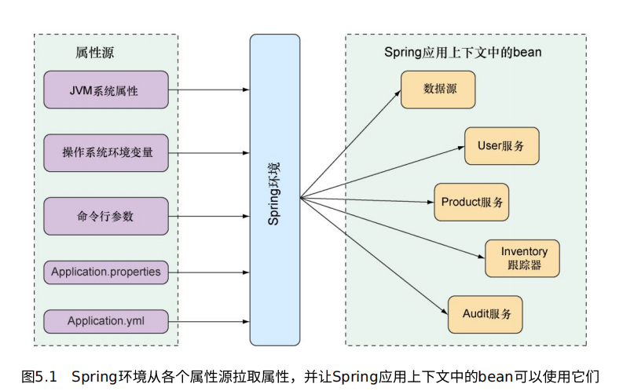

# 第五章 使用配置属性

> **本章内容**
> 细颗粒度的自动装配bean
> 将配置属性应用到应用组件上
> 使用Spring profile

使用Spring的时候，需要写大量冗余的XML配置文件，而使用SpringBoot的自动配置之后，好像又不知道在哪里去显示的配置bean。

Spring Boot提供了配置属性(Configuration property)的方法。配置属性只是Spring应用上下文中的bean属性，可以有多有配置源，包括JVM系统属性，命令行参数以及环境变量。

## 1️⃣细颗粒度的自动装配

Spring中有两种不同(但相关)的配置：

1. bean装配：声明在Spring应用上下文中创建那些组件以及它们之间如何相互注入的配置
2. 属性注入：设置Spring应用上下文中bean的值的配置

在基于Java的配置中，带有 [Bean](https://www.notion.so/Bean-37f5b779a2e54ccd8c61a6c8d3ac8348) 注解的方法一般会同时初始化并立即为它的属性设置值。

- 例：不能使用属性时硬编码

  H2数据库声明的配置

  ```java
  @Bean
  public DataSource dataSource() {
  	 return new EmbeddedDataSourceBuilder()
  		 .setType(H2)
  		 .addScript("taco_schema.sql")
  		 .addScripts("user_data.sql", "ingredient_data.sql")
  		 .build();
  }
  ```

  addScript()和addScripts()⽅法设置了⼀些String类型 的属性，它们是在数据源就绪之后要⽤到数据库上的SQL脚本，这是Spring Boot自动配置的一部分。

  但是，这里我们将脚本的名称硬编码到了程序中，如果需要添加或修改一个脚本的名字，这就需要改变代码，这样显然不好，因此我们需要使用配置属性。

- 理解Spring的环境抽象

  Spring的环境抽象是各种配置属性的一站式服务，它抽取了原始的属性，并整合到一起，包括：

    - JVM系统属性
    - 操作系统环境变量
    - 命令行参数
    - 应用属性配置文件

  

  chapter5-configuration

    - 配置监听端口：

      (src/main/resources/application.properties)

      [配置文件spring](https://www.notion.so/spring-41de7aab386f4e7881cf47ac030ac416)

      ```
      server.port=9090
      ```

      或者使yaml的格式

      ```yaml
      server:
          port: 9090
      ```

      或者使用命令行参数启动

      ```bash
      java -jar tacocloud-0.0.5-SNAPSHOT.jar --server.port=9090
      ```

      或者设置操作系统的环境变量(变量名稍微有点不同，来适应不同的操作系统)

      ```bash
      $ export SERVER_PORT=9090
      ```

      或者之后通过配置中心配置

- 配置数据源

  我们也可以使用Java的方法来显示的配置自己的DataSource，但一般没有必要，通过配置文件的方法来配置更加的方便且安全。

  [配置文件spring](https://www.notion.so/spring-41de7aab386f4e7881cf47ac030ac416)

  ```yaml
  spring:
  	datasource:
  	  url: jdbc:mysql://localhost/tacocloud
  		username: tacodb
  		password: tacopassword
  		driver-class-name: com.mysql.cj.jdbc.Driver
  ```

  我们需要添加对应的JDBC驱动，但实际上不需要显示的指定JDBC驱动类，spring会根据url来进行推断（不过可以写在这里，万一有一天想自己写一个数据库驱动类🐶呢）

  如果类路径中存在Tomcat的JDBC连接池，DataSource将会使用该连接池，否则会在类路径下查找并使用其默认连接池：HikariCP

  我们也可以自己设置连接池, 包括：

    - DBCP

    - C3P0

    - Druid

      ```yaml
      spring:
          datasource:		
            type: com.alibaba.druid.pool.DruidDataSource
              druid:
            # 连接池配置
            # 配置初始化大小、最小、最大
            initial-size: 1
            min-idle: 1
            max-active: 20
            # 配置获取连接等待超时的时间
            max-wait: 3000
            validation-query: SELECT 1
            test-on-borrow: false
            test-on-return: false
            test-while-idle: true
            pool-prepared-statements: true
            time-between-eviction-runs-millis: 60000
            min-evictable-idle-time-millis: 300000
            filters: stat,wall,slf4j
      ```

  或者声明应用启动时要执行的数据库初始化脚本

  ```yaml
  spring:
   datasource:
   schema:
   - order-schema.sql
   - ingredient-schema.sql
   - taco-schema.sql
   - user-schema.sql
   data:
   - ingredients.sql
  ```

  在JNDI中配置数据源并让Spring去那⾥进⾏查找

  ```yaml
  spring:
   datasource:
  	 jndi-name: java:/comp/env/jdbc/tacoCloudDS
  ```

  一个JDNI就是将数据库配置另写一个配置文件

    - 如

      ```xml
      <?xml version="1.0" encoding="UTF-8"?>
      <datasources>
      <local-tx-datasource>
        <jndi-name>MySqlDS</jndi-name>
        <connection-url>jdbc:mysql://localhost:3306/lw</connection-url>
        <driver-class>com.mysql.jdbc.Driver</driver-class>
        <user-name>root</user-name>
        <password>rootpassword</password>
      <exception-sorter-class-name>org.jboss.resource.adapter.jdbc.vendor.MySQLExceptionSorter</exception-sorter-class-name>
        <metadata>
        <type-mapping>mySQL</type-mapping>
        </metadata>
      </local-tx-datasource>
      </datasources>
      ```

  如果我们设置了spring.datasource.jndi-name属性，其他的数据库连接属性（已经设置了的话）就会被忽略掉。

- 配置嵌入式服务器

  ```yaml
  server:
   port: 0
  ```

  服务器并不会真的在端⼝0上启动, 会任选⼀个可⽤的端⼝.

  **处理HTTPS请求**

  ⾸先要使⽤JDK的keytool命令⾏⼯具⽣成keystore：

  ```bash
  keytool -keystore mykeys.jks -genkey -alias tomcat -keyalg RSA
  ```

  记住所设置的密码（pengpeng），会生成一个mykeys.jks，一般在cmd执行的路径下，复制到resources路径下,这样可以打包成jar，或者放在服务器上，然后使用file:///path/to/mykeys.jks（具体看自己的存放路径），这样更安全

  [mykeys.jks](%E7%AC%AC%E4%BA%94%E7%AB%A0%20%E4%BD%BF%E7%94%A8%E9%85%8D%E7%BD%AE%E5%B1%9E%E6%80%A7%20516bba997a17432c923c7a05a0b7b5c7/mykeys.jks)

  ```yaml
  server:
   port: 8443
   ssl:
  	 key-store: classpath:ssl/mykeys.jks
  	 key-store-password: pengpeng
  	 key-password: pengpeng
  ```

  将server.port设置为8443，这是在开发阶段HTTPS服务器的常⽤选择。server.ssl.key-store属性应该设置为我们所创建 的keystore⽂件的路径

- 配置日志

  默认情况下Spring Boot 通过Logback配置⽇志，⽇志会以INFO级别写⼊到控制台中

  为了完全控制日志的配置，，可以在类路径下的根目录下（src/main/resources）创建一个  [配置文件logback](https://www.notion.so/logback-3506ff108d094043a444395c0af89e72)

  ```xml
  <configuration>
  	 <appender name="STDOUT" class="ch.qos.logback.core.ConsoleAppender">
  		 <encoder>
  			 <pattern>
  				 %d{HH:mm:ss.SSS} [%thread] %-5level %logger{36} - %msg%n
  			 </pattern>
  		 </encoder>
  	 </appender>
  	 <logger name="root" level="INFO"/>
  	 <root level="INFO">
  		 <appender-ref ref="STDOUT" />
  	 </root>
  </configuration>
  ```

  当然也直接使用Spring Boot来配置

  要设置⽇志级别，我们可以创建以logging.level作为前缀的属性， 随后紧跟着的是我们想要设置⽇志级别的logger。假设，我们想要将 root logging设置为WARN级别，但是希望将Spring Security的⽇志 级别设置为DEBUG。

  ```yaml
  logging:
   level:
  	 root: WARN
  	 org:
  		 springframework:
  			 security: DEBUG
  ```

  可以将Spring Security的包名扁平化到⼀⾏中，使其更易于阅读：

  ```yaml
  logging:
   level:
  	 root: WARN
  	 org.springframework.security: DEBUG
  ```

  将⽇志条⽬写⼊到“/var/logs/”中的TacoCloud.log⽂件中

  ```yaml
  logging:
   path: /var/logs/
   file: TacoCloud.log
   level:
  	 root: WARN
  	 org:
  		 springframework:
  			 security: DEBUG
  ```

  默认情况下，⽇志⽂件⼀旦达 到10MB，就会轮换

- 使用特定的属性值

  ${}占位符

  ```yaml
  greeting:
   welcome: ${spring.application.name}
  ```

  可以将占位符嵌入到其他文本中：

  ```yaml
  greeting:
   welcome: You are using ${spring.application.name}.
  ```

## 2️⃣创建自己的配置属性

消费配置属性

Spring Boot提供了 ConfigurationProperties注解。将它放到Spring bean上之后，它 就会为该bean中那些能够根据Spring环境注⼊值的属性赋值。

- pageNumber例子

  为taco cloud添加一个功能：列出当前认证⽤户过去的订单

    - 在OrderRepository中添加方法

      ```java
      List<Order> findByUserOrderByPlaceAtDesc(User user);
      ```

      使⽤了OrderByPlacedAtDesc⼦句。OrderBy区域指定了结果要按照什么属性来排序，Desc声明要按照降序进⾏排列，返回的订单将会按照时间由近及远进⾏排序

    - 改变OrderController

      ```java
      @GetMapping
      public String ordersForUser(@AuthenticationPrincipal User user, Model model){
          model.addAttribute("order", orderRepo.findByUserOrderByPlaceAtDesc(user));
          return "orderList";
      }
      ```

    - 为显⽰的订单数量分页

      ```java
      List<Order> findByUserOrderByPlaceAtDesc(User user, Pageable pageable);
      ```

      ```java
      @GetMapping
      public String ordersForUser(@AuthenticationPrincipal User user, Model model){
          Pageable pageable = PageRequest.of(0, 20);
          model.addAttribute("order", orderRepo.findByUserOrderByPlaceAtDesc(user, pageable));
          return "orderList";
      }
      ```

      Pageable是Spring Data根据⻚号 和每⻚数量选取结果的⼦集的⼀种⽅法。在ordersForUser()控制器⽅ 法中，我们构建了⼀个PageRequest对象，该对象实现了Pageable， 我们将其声明为请求第⼀⻚（序号为0）的数据，并且每⻚数量为20， 这样我们就能获取当前⽤户最近的20个订单。

      这种写法如果需要更改分页的数量，就需要修改代码并重新部署，显然是不可行的。

    - 使用 [ConfigurationProperties](https://www.notion.so/ConfigurationProperties-6eab438fcefe4240bbab2e9f1c4bf782)

      配置文件中添加

      ```yaml
      taco:
       orders:
       pageSize: 10
      ```

      ```java
      @Slf4j
      @Controller
      @RequestMapping("/orders")
      @SessionAttributes("order")
      @ConfigurationProperties(prefix = "taco.orders")
      public class OrderController {
      
          private int pageSize = 20;
          public void setPageSize(int pageSize){
              this.pageSize = pageSize;
          }
      
          @GetMapping
          public String ordersForUser(@AuthenticationPrincipal User user, Model model){
              Pageable pageable = PageRequest.of(0, pageSize);
              model.addAttribute("order", orderRepo.findByUserOrderByPlaceAtDesc(user, pageable));
              return "orderList";
          }
      }
      ```

      添加了@ConfigurationProperties注 解。它的prefix属性设置成了taco.orders，这意味着当设置pageSize的时候，我们需要使⽤名为taco.orders.pageSize的配置属性

      如果在⽣产环境中需要快速更改，我们可以将taco.orders.pageSize设置为环境变量，这样就不⽤重新构建和重新部署应⽤了：

      ```bash
      export TACO_ORDERS_PAGESIZE=10
      ```

- 定义配置属性的持有者

  [ConfigurationProperties](https://www.notion.so/ConfigurationProperties-6eab438fcefe4240bbab2e9f1c4bf782) 实际上通常会放到⼀种特 定类型的bean中，这种bean的⽬的就是持有配置数据。这样的话，特定的配置细节就能从控制器和其他应⽤程序类中抽离出来，多个bean也 能更容易地共享⼀些通⽤的配置。

  ```java
  @Component
  @ConfigurationProperties(prefix = "taco.orders")
  @Data
  @Validated
  public class OrderProps {
      @Min(value = 5, message="must be between 5 and 25")
      @Max(value = 25, message="must be between 5 and 25")
      private int pageSize = 20;
  }
  ```

  [`Validated`](https://www.notion.so/Validated-0a17e42c95564d049edcefbacaabc99d) [Max](https://www.notion.so/Max-e8b38a7abfb14aca8c7d27d5c12d4597) [Min](https://www.notion.so/Min-8744ec21ddde4aeab5718bb271313363)

  ```java
  @Slf4j
  @Controller
  @RequestMapping("/orders")
  @SessionAttributes("order")
  public class OrderController {
  
      private OrderProps orderProps;
  
      private OrderRepository orderRepo;
  
      @Autowired
      public OrderController(OrderRepository orderRepo, OrderProps orderProps) {
          this.orderRepo = orderRepo;
          this.orderProps = orderProps;
      }
  // ...
  
      @GetMapping
      public String ordersForUser(@AuthenticationPrincipal User user, Model model){
          Pageable pageable = PageRequest.of(0, orderProps.getPageSize());
          model.addAttribute("order", orderRepo.findByUserOrderByPlaceAtDesc(user, pageable));
          return "orderList";
      }
  // ...
  }
  ```

  OrderController不需要负责处理⾃⼰的配置属性了。这样 能够让OrderController中的代码更加整洁⼀些，并且能够让其他的bean重⽤OrderProps中的属性。

  ```
  @Component
  @ConfigurationProperties(prefix = "taco.orders")
  @Data
  @Validated
  public class OrderProps {
      @Min(value = 5, message="must be between 5 and 25")
      @Max(value = 25, message="must be between 5 and 25")
      private int pageSize = 20;
  }
  ```

  ```
  @Component
  @ConfigurationProperties(prefix = "taco.orders")
  @Data
  @Validated
  public class OrderProps {
      @Min(value = 5, message="must be between 5 and 25")
      @Max(value = 25, message="must be between 5 and 25")
      private int pageSize = 20;
  }
  ```

  ```
  @Component
  @ConfigurationProperties(prefix = "taco.orders")
  @Data
  @Validated
  public class OrderProps {
      @Min(value = 5, message="must be between 5 and 25")
      @Max(value = 25, message="must be between 5 and 25")
      private int pageSize = 20;
  }
  ```

- 声明配置属性的元数据
  创建的配置属性缺少元数据,即配置的标注和解释

  为了创建⾃定义配置属性的元数据，我们需要在META-INF下创建 ⼀个名为additional-spring-configuration-metadata.json的⽂件

    ```json
  {
   "properties": [
   {
   "name": "taco.orders.page-size",
   "type": "java.lang.String",
   "description":
   "Sets the maximum number of orders to display in a list."
   }
   ]
  }
    ```

  创建了meta-data之后的属性具有信息提示和自动补全

  配置属性对于调整⾃动配置的组件以及应⽤程序⾃ ⾝的bean都⾮常有⽤

## 3️⃣使用profile进行配置

当应⽤部署到不同的运⾏时环境中的时候，有些配置细节通常会有 些差别。例如，数据库连接的细节在开发环境和质量保证（quality assurance）环境中可能就不相同，⽽它们与⽣产环境可能⼜不⼀样。

有种办法就是使⽤环境变量，通过 这种⽅式来指定配置属性，⽽不是在application.properties和
application.yml中进⾏定义

```bash
% export SPRING_DATASOURCE_URL=jdbc:mysql://localhost/tacocloud
% export SPRING_DATASOURCE_USERNAME=tacouser
% export SPRING_DATASOURCE_PASSWORD=tacopassword
```

如果配置属性⽐较多，那么将它们声 明为环境变量会⾮常⿇烦。除此之外，我们没有好的⽅式来跟踪环境变 量的变化，也⽆法在出现错误的时候进⾏回滚。

profile是⼀种 条件化的配置，在运⾏时，根据哪些profile处于激活状态，可以使⽤或忽略不同的bean、配置类和配置属性

为了开发和调试⽅便，我们希望使⽤嵌⼊式的H2数据库，并 且Taco Cloud代码的⽇志级别为DEBUG。但是在⽣产环境中，我们希望使⽤外部的MySQL数据库，并将⽇志级别设置为WARN。

- 定义特定的profile的属性

  定义特定profile相关的属性的⼀种⽅式就是创建另外⼀个YAML或 属性⽂件，其中只包含⽤于⽣产环境的属性。⽂件的名称要遵守如下的 约定：application-{profile名}.yml或 application-{profile名}.properties。

    - application.yaml

      ```yaml
      logging:
       level:
           tacos: DEBUG
      ```

    - application-prod.ym

      ```yaml
      spring:
       datasource:
           url: jdbc:mysql://localhost/tacocloud
           username: tacouser
           password: tacopassword
      logging:
       level:
           tacos: WARN
      ```

  定义特定profile相关的属性的另外⼀种⽅式仅适⽤于YAML配置。 它会将特定profile的属性和⾮profile的属性都放到application.yml
  中，它们之间使⽤3个中划线进⾏分割，并且使⽤spring.profiles属性来命名profile。

    - application.yaml

      ```yaml
      logging:
       level:
           tacos: DEBUG
      ---
      spring:
       profiles: prod
       datasource:
           url: jdbc:mysql://localhost/tacocloud
           username: tacouser
           password: tacopassword
      logging:
       level:
           tacos: WARN
      ```

- 激活profile

  [配置文件spring](https://www.notion.so/spring-41de7aab386f4e7881cf47ac030ac416)

  要激活某个profile，需要 做的就是将profile名称的列表赋值给spring.profiles.active属性(这可能是激活profile最糟糕的⼀种⽅式)

  ```yaml
  spring: 
  	profiles: 
  		active: 
  		- prod
  ```

  推荐使⽤环境变量来设置 处于激活状态的profile。

  ```bash
  % export SPRING_PROFILES_ACTIVE=prod
  ```

  这样部署到该机器上的任何应⽤就都会激活prod profile，对应的 属性会⽐默认profile具备更⾼的优先级。

  如果以可执⾏JAR⽂件的形式运⾏应⽤，那么我们还可以以命令⾏ 参数的形式设置激活的profile：

  ```bash
  % java -jar taco-cloud.jar --spring.profiles.active=prod
  ```

  spring.profiles.active属性名是复数形式的
  profile，这意味着可以设置多个激活的profile。如果使⽤环境变量， 通常这可以通过逗号分隔的列表来实现：

  ```bash
  % export SPRING_PROFILES_ACTIVE=prod,audit,ha
  ```

  或使用yaml文件

  ```yaml
  spring:
   profiles:
  	 active:
  	 - prod
  	 - audit
  	 - ha
  ```

  将Spring应⽤部署到Cloud Foundry中，将会⾃动激活⼀个名为cloud的profile。

- 使用profile条件化的创建bean

  为不同的profile创建⼀组独特的bean是⾮常有⽤的。希望某些bean仅在特定profile激活 的情况下才需要创建。在这种情况下， [Profile](https://www.notion.so/Profile-cbc34661e68443df975dd82a547be971) 注解可以将某些bean设置为仅适⽤于给定的profile

  例如，在TacoCloudApplication中，我们有⼀个CommandLineRunner bean，它⽤来在应⽤启动的时候加载嵌⼊式数据库和配料数据。对于开发阶段来讲，这是很不错的；但是对于⽣产 环境的应⽤来说，就没有必要（也是不符合需求的）了。

    - Profile(”dev”)

      可以为声明CommandLineRunner bean的⽅法添加@Profile注解

      ```java
      @Bean
      @Profile("dev")
      public CommandLineRunner dataLoader(IngredientRepository repo,
       UserRepository userRepo, PasswordEncoder encoder) {
       ...
      }
      ```

    - Profile({”dev”, “qa“})

      在dev**或**qa profile激活的时候都需要创建
      CommandLineRunner。

      ```java
      @Bean
      @Profile({"dev", "qa"})
      public CommandLineRunner dataLoader(IngredientRepository repo,
       UserRepository userRepo, PasswordEncoder encoder) {
       ...
      }
      ```

    - Profile("!prod")

      **除了**prod激活时，CommandLineRunner bean都需要创建

      ```java
      @Bean
      @Profile("!prod")
      public CommandLineRunner dataLoader(IngredientRepository repo,
       UserRepository userRepo, PasswordEncoder encoder) {
       ...
      }
      ```

    - Profile({"!prod", "!qa"})

      可以在带有@Configuration注解的类上使⽤@Profile,

      ```java
      @Profile({"!prod", "!qa"})
      @Configuration
      public class DevelopmentConfig {
       @Bean
       public CommandLineRunner dataLoader(IngredientRepository repo,
       UserRepository userRepo, PasswordEncoder encoder) {
       // ...
       }
      }
      ```

      CommandLineRunner bean（包括
      DevelopmentConfig中定义的其他bean）只有在prod和qa均没有激 活的情况下才会创建

## 🈴小结

- Spring Bean可以添加ConfigurationProperties注解，这个样就可以多个属性源中选取一个来注入它的值
- 配置属性可以通过命令行参数、环境变量、JVM系统参数、属性文件或YAML文件等方式来进行设置。
- 配置文件可以用来覆盖自动配置相关的设置，包括指定数据源URL和日志级别
- Spring profile何以与属性源协同使用，从而能够基于激活profile条件话的设置配置属性