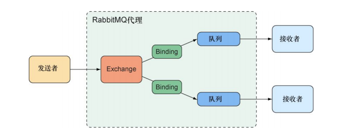
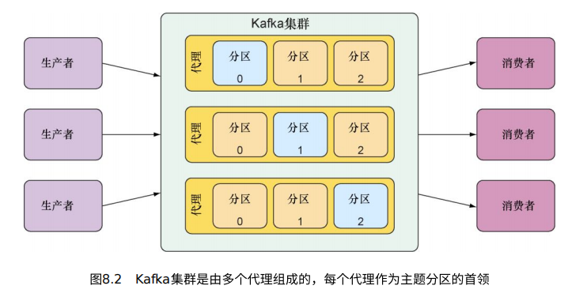

# 第八章 发送异步消息

> **本章内容**
> 异步化的消息
> 使用JMS RabbitMQ和Kafka发送消息
> 从代理拉取消息
> 监听消息

spring提供了三种异步消息方案：

- Java消息服务(Java Message Service, JMS)
- RabbitMQ和高级消息队列协议(Advanced Message Queueing protocol)
- Apache kafka

除了基础的发送和接收消息之外，Spring对消息驱动POJO的支持，是一种与EJB的消息驱动Bean（Message-Driven Bean， MDB）类似的消息接受方式。

## 1️⃣使用JMS发送消息

JMS是一个Java标准，定义了使用消息代理(message broker)的通用api，在JMS出现之前，每个消息都有私有的API，这使得不同代理之间的消息代码很难通用，借助JMS，所有遵循规范的实现都是用通用的接口，就好像JDBC为数据库操作提供了通用的接口一样。

Spring通过基于模板的抽象为JMS功能提供了支持就是JmsTemplate，借助JmsTemplate，我们可以非常容易的在消息生产方发送消息队列和主题消息，在消费消息的那一方，也能够非常容易的接收消息。Spring还提供了消息驱动POJO，及一个简单的Java对象，能够以异部的方式响应队列或主题上达到的消息。

- 搭建JMS环境

  将JMS客户端添加到项目的构建文件中，选择artemis（这是重新实现的下一代ActiveMQ）

  ```xml
  <dependency>
   <groupId>org.springframework.boot</groupId>
   <artifactId>spring-boot-starter-artemis</artifactId>
  </dependency>
  ```

  默认情况下，Artemis代理运行在61616端口
  spring.artemis.host 代理的主机
  spring.artemis.port 代理的端⼝
  spring.artemis.user ⽤来访问代理的⽤户（可选）
  spring.artemis.password ⽤来访问代理的密码（可选）

  ```yaml
  spring:
   artemis:
   host: artemis.tacocloud.com
   port: 61617
   user: tacoweb
   password: l3tm31n
  ```

  ActiveMQ的配置：

  spring.activemq.broker-url 代理的URL
  spring.activemq.user ⽤来访问代理的⽤户（可选）
  spring.activemq.password ⽤来访问代理的密码（可选）
  spring.activemq.in-memory 是否启⽤在内存中运⾏的代理（默认为true）

  ```yaml
  spring:
   activemq:
   broker-url: tcp://activemq.tacocloud.com
   user: tacoweb
   password: l3tm31n
  ```

- 使用JMSTemplate发送消息

  将JMS starter依赖添加到构建文件中后，spring boot会自动配置一个JmsTemplate，可以将其注入到其它bean中使用。

    - JmsTemplate有多个用来发送消息的方法：

      ```java
      // 发送原始的消息
      void send(MessageCreator messageCreator) throws JmsException;
      void send(Destination destination, MessageCreator messageCreator)
       throws JmsException;
      void send(String destinationName, MessageCreator messageCreator)
       throws JmsException;
      // 发送根据对象转换⽽成的消息
      void convertAndSend(Object message) throws JmsException;
      void convertAndSend(Destination destination, Object message)
       throws JmsException;
      void convertAndSend(String destinationName, Object message)
       throws JmsException;
      // 发送根据对象转换⽽成的消息并且带有后期处理的功能
      void convertAndSend(Object message,
       MessagePostProcessor postProcessor) throws JmsException;
      void convertAndSend(Destination destination, Object message,
       MessagePostProcessor postProcessor) throws JmsException;
      void convertAndSend(String destinationName, Object message,
       MessagePostProcessor postProcessor) throws JmsException;
      ```

  其实实际上只有两个方法,也就是send()和convertAndSend()，每个方法都有重载形式以支持不同而参数。接受的参数也有些不同，包括可以生成消息的MessageCreator，或可以转化成message的Object还有对消息做后处理的MessagePostProcessor对象。

  发送方式有：

    - 不接受目的地参数，将消息发送到默认的目的地

    - 接受Destination对象，该对象制定了 小写的目的地

    - 接受收String，通过名字的形式指定了的目的地

    - 一个简单的send()消息发送服务

      ```java
      package tacos.messaging;
      import javax.jms.JMSException;
      import javax.jms.Message;
      import javax.jms.Session;
      import org.springframework.beans.factory.annotation.Autowired;
      import org.springframework.jms.core.JmsTemplate;
      import org.springframework.jms.core.MessageCreator;
      import org.springframework.stereotype.Service;
      @Service
      public class JmsOrderMessagingService implements OrderMessagingService {
               private JmsTemplate jms;
               @Autowired
               public JmsOrderMessagingService(JmsTemplate jms) {
                       this.jms = jms;
               }
               @Override
               public void sendOrder(Order order) {
                       jms.send(new MessageCreator() {
                               @Override
                               public Message createMessage(Session session)
                                           throws JMSException {
                                       return session.createObjectMessage(order);
                               }
                       }
                   );
               }
      }
      ```

      sendOrder()方法调用了jms.send()并传递了MessageCreator接口的一个匿名内部实现。这里还可以使用lambda表达式简化一下

      ```java
      @Override
      public void sendOrder(Order order) {
       jms.send(session -> session.createObjectMessage(order));
      }
      ```

      由于这个send方法并没有指定目的地，所以会使用配置的默认目的地，这个在配置文件中声明：

      ```yaml
      spring:
       jms:
       template:
       default-destination: tacocloud.order.queue
      ```

    - 传递Destination对象作为send()方法的第一个参数

      声明一个destination bean并注入到处理消息 的bean中

      例如：

      ```java
      @Bean
      public Destination orderQueue() {
       return new ActiveMQQueue("tacocloud.order.queue");
      }
      ```

      ActiveMQQueue来源于Artemis（来⾃org.apache. activemq.artemis.jms.client包）

      ```java
      private Destination orderQueue;
      @Autowired
      public JmsOrderMessagingService(JmsTemplate jms,
       Destination orderQueue) {
       this.jms = jms;
       this.orderQueue = orderQueue;
      }
      ...
      @Override
      public void sendOrder(Order order) {
       jms.send(
       orderQueue,
       session -> session.createObjectMessage(order));
      }
      ```

    - 使用Destination名称来作为send()的参数

      Destination对象可以设置更多的属性，但有时只是指定目的地就可以了，就直接使用名称就可以了

      ```java
      @Override
      public void sendOrder(Order order) {
       jms.send(
       "tacocloud.order.queue",
       session -> session.createObjectMessage(order));
      }
      ```

    - 消息发送前进行转换convertAndSend()

      convertAndSend()⽅法简化了消息的发布，因为它不再 需要MessageCreator。

      将要发送的对象直接传递给convertAndSend()， 这个对象在发送之前会被转换成Message。

      ```java
      @Override
      public void sendOrder(Order order) {
       jms.convertAndSend("tacocloud.order.queue", order);
      }
      ```

      同样，可以不设置发送目的地，或使用Destination对象来指定

    - 配置消息转换器MessageConverter

      MessageConverter是Spring定义的接⼝，只有两个需要实现的⽅法

      ```java
      public interface MessageConverter {
       Message toMessage(Object object, Session session)
       throws JMSException, MessageConversionException;
       Object fromMessage(Message message)
      }
      ```

      我们通常并没有必要创建⾃定义的实现，Spring已经提供了多个实现：（**org.springframework.jms.support.converter**）

        - MappingJackson2MessageConverter
          使⽤Jackson 2 JSON库实现消息与JSON格式之间的 相互转换
        - MarshallingMessageConverter 使⽤JAXB库实现消息与XML格式之间的相互转换
        - MessagingMessageConverter
          使⽤底层的MessageConverter实现消息抽象的
          Message载荷与javax.jms.Message之间的转换， 同时会使⽤JmsHeaderMapper实现JMS头信息与标 准消息头信息之间的转换
        - SimpleMessageConverter
          实现String与TextMessage之间的相互转换、字节 数组与BytesMessage之间的相互转换、Map与
          MapMessage之间的相互转换以及Serializable对 象与ObjectMessage之间的相互转换

      默认情况下，将会使⽤SimpleMessageConverter，但是它需要被发送的 对象实现Serializable。为了使用不同的消息转换器，需要将选中的消息转换器 实例声明为⼀个bean：

      ```java
      @Bean
      public MappingJackson2MessageConverter messageConverter() {
       MappingJackson2MessageConverter messageConverter =
       new MappingJackson2MessageConverter();
       messageConverter.setTypeIdPropertyName("_typeId");
       return messageConverter;
      }
      ```

      MappingJackson2MessageConverter的setTypeId PropertyName()⽅法，这样能够让接收者知道传⼊的消息要转换成什么类型。默认情 况下，它将会包含要转换的类型的全限定类名，并要求接收端也包含相同的类型，并且具有相同的全限定类名。这样显然不够灵活，可以通过调⽤消息转换器的setTypeIdMappings()⽅法将⼀个合成类型名映射到实际类型上。

      ```java
      @Bean
      public MappingJackson2MessageConverter messageConverter() {
       MappingJackson2MessageConverter messageConverter =
       new MappingJackson2MessageConverter();
       messageConverter.setTypeIdPropertyName("_typeId");
       Map<String, Class<?>> typeIdMappings = new HashMap<String, Class<?>>();
       typeIdMappings.put("order", Order.class);
       messageConverter.setTypeIdMappings(typeIdMappings);
       return messageConverter;
      }
      ```

      在接收端的应⽤中，将会配置类似的消息转换器，将order映射为它⾃ ⼰能够理解的订单类型。在接收端的订单可能位于不同的包中、有不同的类名， 甚⾄可以只包含发送者Order属性的⼀个⼦集。

    - 对消息进行后期处理

      假设Taco分为网上订购和餐厅订购，不同的来源对应不同的处理方式。可以在Order对象上添加⼀个新的source属性，让它携带该信息：如 果是在线订单，就将其设置为WEB；如果是店⾯⾥的订单，就将其设置为STORE。不过这样就需要同时修改Web站点的Order类和厨房应⽤的Order类，同时实际上这个信息除了标识之外没有业务上的作用，只有taco的准备⼈员需要该信息。

      因此，避免直接修改领域对象，可以为消息添加一个自定义头部，让它携带额外的信息：

      如果使用send()方法，可以调用message的的setStringProperty()方法

      ```java
      jms.send("tacocloud.order.queue",
       session -> {
       Message message = session.createObjectMessage(order);
       message.setStringProperty("X_ORDER_SOURCE", "WEB");
       });
      ```

      如果使用convertAndSend()方法，那么就需要传递一个MessagePostProcessor来添加后处理过程

      ```java
      jms.convertAndSend("tacocloud.order.queue", order, new MessagePostProcessor() {
           @Override
           public Message postProcessMessage(Message message) throws JMSException {
               message.setStringProperty("X_ORDER_SOURCE", "WEB");
               return message;
           }
      });
      ```

      同时可以使用lambda表达式来优化函数式接口的匿名内部类

      ```java
      jms.convertAndSend("tacocloud.order.queue", order,
           message -> {
               message.setStringProperty("X_ORDER_SOURCE", "WEB");
               return message;
           });
      ```

      同时，如果在代码中多次调用convertAndSend并使用相同的MessagePostProcessor，那么方法引用是比lambda更好的方案：

      ```java
      @GetMapping("/convertAndSend/order")
      public String convertAndSendOrder() {
       Order order = buildOrder();
       jms.convertAndSend("tacocloud.order.queue", order,
       this::addOrderSource);
       return "Convert and sent order";
      }
      private Message addOrderSource(Message message) throws JMSException {
       message.setStringProperty("X_ORDER_SOURCE", "WEB");
       return message;
      }
      ```

- 接受JMS消息

  在消费消息时，我们可以选择模式和(pull model)和推送模式(push model)，前者会在代码中请求消息并一直等待知道消息到达为止，后者会在消息可用的时候自动在代码中执行。

  jmsTemplate提供的都是拉取模式，当请求消息时，线程会一直阻塞知道一个消息抵达为止。

  另外，我们看可以使用推送模式，使用一个消息监听器，每当有消息可用是，就会被调用。

  推送模式不会阻塞线程，但如果消息抵达的速度太快，那么监听器可能会过载。

  拉取模式允许消费者声明合适才接收消息，从而可以自适应的使用。

    - JmsTemplate提供了多个对代理的拉去方法，其中包括

      ```java
      Message receive() throws JmsException;
      Message receive(Destination destination) throws JmsException;
      Message receive(String destinationName) throws JmsException;
      Object receiveAndConvert() throws JmsException;
      Object receiveAndConvert(Destination destination) throws JmsException;
      Object receiveAndConvert(String destinationName) throws JmsException;
      ```

    - 使用JmsTemplate.receive()来接受订单数据

      ```java
      package tacos.kitchen.messaging.jms;
      import javax.jms.Message;
      import org.springframework.beans.factory.annotation.Autowired;
      import org.springframework.jms.core.JmsTemplate;
      import org.springframework.jms.support.converter.MessageConverter;
      import org.springframework.stereotype.Component;
      @Component
      public class JmsOrderReceiver implements OrderReceiver {
       private JmsTemplate jms;
       private MessageConverter converter;
       @Autowired
       public JmsOrderReceiver(JmsTemplate jms, MessageConverter converter) {
       this.jms = jms;
       this.converter = converter;
       }
       public Order receiveOrder() {
       Message message = jms.receive("tacocloud.order.queue");
       return (Order) converter.fromMessage(message);
       }
      }
      ```

      使⽤String值来指定从哪个⽬的地拉取订单，receive()返回的是没有经过转换的Message，真正需要的是Message中的Order，所以接 下来使⽤被注⼊的消息转换器对消息进⾏转换。消息中的type ID属性将会指导转换器将消息转换成Order，但它返回的是Object，所以在最终返回之前要进⾏类型转换。

    - 只接收消息的载荷receiveAndConvert()

      要探查消息的属性和消息头信息，那么接收原始的Message对象可 能会⾮常有⽤，但在其它大多数的时候，只需要消息的载荷，就可以直接使用⽤receiveAndConvert()替换receive()：

      ```java
      package tacos.kitchen.messaging.jms;
      import org.springframework.beans.factory.annotation.Autowired;
      import org.springframework.jms.core.JmsTemplate;
      import org.springframework.stereotype.Component;
      @Component
      public class JmsOrderReceiver implements OrderReceiver {
       private JmsTemplate jms;
       @Autowired
       public JmsOrderReceiver(JmsTemplate jms) {
       this.jms = jms;
       }
       public Order receiveOrder() {
       return (Order) jms.receiveAndConvert("tacocloud.order.queue");
       }
      }
      ```

    - 声明JMS监听器

      拉取模式需要显示的调用receive()或receiveAndConvert()才能接受消息，消息监听器是⼀个被动的组件，在消息抵达之前，它会⼀直处于空闲状态。

      要创建能够对JMS消息做出反应的消息监听器，我们需要为组件中的某个方法添加 [JmsListener](https://www.notion.so/JmsListener-12f1e08af3fa48329c095a36c6693d5c) 注解

      ```java
      package tacos.kitchen.messaging.jms.listener;
      import org.springframework.beans.factory.annotation.Autowired;
      import org.springframework.jms.annotation.JmsListener;
      import org.springframework.stereotype.Component;
      @Component
      public class OrderListener {
           private KitchenUI ui;
           @Autowired
           public OrderListener(KitchenUI ui) {
               this.ui = ui;
           }
           @JmsListener(destination = "tacocloud.order.queue")
           public void receiveOrder(Order order) {
               ui.displayOrder(order);
           }
      }
      ```

      @JmsListener注解都和Spring MVC中的请求映射注解很 相似，⽐如@GetMapping或@PostMapping。在Spring MVC中，带有请求映 射注解的⽅法会响应指定路径的请求。与之类似，使⽤@JmsListener注解的⽅ 法会对到达指定⽬的地的消息做出响应。

      如果消息能够快速得到处理，那么它们是⾮常适合的⽅案。但是，如果消息处理器需要根据⾃⼰的时间请求更多消息， 那么JmsTemplate提供的拉取模式会更加合适。

      在Java中实现消息时它是常⻅的可选⽅案。但是JMS有⼀些缺点，尤其是作为Java规 范，它只能⽤在Java应⽤中。RabbitMQ和Kafka等较新的消息传递⽅案克服了 这些缺点，可以⽤于JVM之外的其他语⾔和平台。

## 2️⃣使用RabbitMQ和AMQP

RabbitMQ是AMPQ的一种实现，提供了JMS更高级的路由策略。JMS消息使用目的地名称来寻址，接收者要从这里检索信息，而AMQP消息使用Exchange和routing key来寻址，这样消息就与接收者要监听的队列解耦。



当消息抵达RabbitMQ代理的时候，它会进入为其设置的Exchange上，Exchange负责将消息路由到一个或多个队列上，这个过程会利用Exchange的类型，Exchange和队列之间的binging以及消息的routing key进行路由。

- 不同的Exchange类型

    - Default: 将消息路由到**名字**与消息routing key相同的队列。所有的队列都会自动绑定至Default Exchange
    - Direct: 如果消息的routing key与队列的**binding key** 那么消息会路由到该队列中
    - Topic：如果消息的routing key（可能包含通配符）与队列的binding key**匹配**，那么消息将会路由到一个或多个这样的队列上。
    - Fanout：不管routing key和binding key是什么，消息都将会路由到**所有**的绑定队列上。
    - Headers: 与Topic Exchange类似，基于消息的**头信息**进行路由，而不是routing key
    - Dead letter：捕获所有⽆法投递（也就是它们⽆法匹配所有已定义的Exchange和队列的binding关系）的消息。

  Default和Fanout⼤致对应了JMS中 的队列和主题

- 添加RabbitMQ到Spring中

    - 添加依赖

      ```xml
      <dependency>
          <groupId>org.springframework.boot</groupId>
          <artifactId>spring-boot-starter-amqp</artifactId>
      </dependency>
      ```

      AMQP的自动配置功能会为我们创建一个AMQP连接工厂和RabbitTemplate bean以及一些其他的支持组件

    - 一些配置项

      ```
      spring.rabbitmq.addresses 逗号分隔的RabbitMQ代理地址列表
      spring.rabbitmq.host 代理的主机（默认为localhost）
      spring.rabbitmq.port 代理的端⼝（默认为5672）
      spring.rabbitmq.username 访问代理所使⽤的⽤户名（可选）
      spring.rabbitmq.password 访问代理所使⽤的密码（可选）
      ```

      生产环境的可能配置

      ```yaml
      spring:
       profiles: prod
       rabbitmq:
       host: rabbit.tacocloud.com
       port: 5673
       username: tacoweb
       password: l3tm31n
      ```

  [Docker RabbitMQ](https://www.notion.so/Docker-RabbitMQ-47b291024efd4804b135d0b72e934645)

- 通过RabbitTemplate发送消息

  Spring对RabbitMQ消息支持的核心是RabbitTemplate，同样具有send()和convertAndSend()方法，不过JmsTemplate根据队列和主题来发送消息，RabbitTemplate按照Exchanges和routing key来发送消息。

    - 常用方法：

      ```java
      // 发送原始的消息
      void send(Message message) throws AmqpException;
      void send(String routingKey, Message message) throws AmqpException;
      void send(String exchange, String routingKey, Message message)
       throws AmqpException;
      // 发送根据对象转换⽽成的消息
      void convertAndSend(Object message) throws AmqpException;
      void convertAndSend(String routingKey, Object message)
       throws AmqpException;
      void convertAndSend(String exchange, String routingKey,
       Object message) throws AmqpException;
      // 发送根据对象转换⽽成的消息并且带有后期处理的功能
      void convertAndSend(Object message, MessagePostProcessor mPP)
       throws AmqpException;
      void convertAndSend(String routingKey, Object message,
       MessagePostProcessor messagePostProcessor)
       throws AmqpException;
      void convertAndSend(String exchange, String routingKey,
       Object message,
       MessagePostProcessor messagePostProcessor)
       throws AmqpException;
      ```

      会接受String类型 的值以指定Exchange和routing key，⽽不像JmsTemplate那样接受⽬的地名 称（或Destination）。没有接受Exchange参数的⽅法会将消息发送⾄Default
      Exchange，没有指定routing key的⽅法会把消息路由⾄默认的 routing key。

    - send()方法的简单使用

      ```java
      package tacos.messaging;
      import org.springframework.amqp.core.Message;
      import org.springframework.amqp.core.MessageProperties;
      import org.springframework.amqp.rabbit.core.RabbitTemplate;
      import org.springframework.amqp.support.converter.MessageConverter;
      import org.springframework.beans.factory.annotation.Autowired;
      import org.springframework.stereotype.Service;
      import tacos.Order;
      @Service
      public class RabbitOrderMessagingService
       implements OrderMessagingService {
       private RabbitTemplate rabbit;
       @Autowired
       public RabbitOrderMessagingService(RabbitTemplate rabbit) {
       this.rabbit = rabbit;
       }
       public void sendOrder(Order order) {
       MessageConverter converter = rabbit.getMessageConverter();
       MessageProperties props = new MessageProperties();
       Message message = converter.toMessage(order, props);
       rabbit.send("tacocloud.order", message);
       }
      }
      ```

      可以使用MessageProperties来提供消息属性，但是如果不需要 设置任何这样的属性，使⽤默认的MessageProperties实例就可以。调⽤send()方法时Exchange和routing key这两个参数都是可选的，最后 连同消息⼀起传递过去。

    - 默认属性的设置

      默认的Exchange，它的名字是“”（空的String），对应 RabbitMQ代理⾃动⽣成的Default Exchange。与之相似，默认的routing key
      也是“”（它的路由将会取决于Exchange以及相应的binding）。

      ```yaml
      spring:
       rabbitmq:
       template:
       exchange: tacocloud.orders
       routing-key: kitchens.central
      ```

    - 使用convertAndSend()方法

      ```java
      public void sendOrder(Order order) {
       rabbit.convertAndSend("tacocloud.order", order);
      }
      ```

    - 配置消息转换器

      默认情况下，消息转换是通过SimpleMessageConverter来实现的，它能 够将简单类型（如String）和Serializable对象转换成Message对象。

      spring实际上提供了多个消息转换器：

        - Jackson2JsonMessageConverter：使⽤Jackson 2 JSON实现对象和
          JSON的相互转换。
        - MarshallingMessageConverter：使⽤Spring的Marshaller和
          Unmarshaller进⾏转换。
        - SerializerMessageConverter：使⽤Spring的Serializer和Deserializer
          转换String和任意种类的原⽣对象。
        - SimpleMessageConverter：转换String、字节数组和Serializable类型。
        - ContentTypeDelegatingMessageConverter：基于contentType头信息，将转换功能委托给另外⼀个MessageConverter。
        - MessagingMessageConverter：将消息转换功能委托给另外⼀个
          MessageConverter，并将头信息的转换委托给AmqpHeaderConverter。

      变更消息转换器只需要配置一个想要的bean，然后注入即可

      ```java
      @Bean
      public MessageConverter messageConverter() {
       return new Jackson2JsonMessageConverter();
      }
      ```

    - 设置消息属性

      使用send()方法的时候，在⾃⾏创建Message的时候，我们可以通过MessageProperties实例设置头信息，随后将这个对象传递给消息转换器。

      ```java
      public void sendOrder(Order order) {
       MessageConverter converter = rabbit.getMessageConverter();
       MessageProperties props = new MessageProperties();
       props.setHeader("X_ORDER_SOURCE", "WEB");
       Message message = converter.toMessage(order, props);
       rabbit.send("tacocloud.order", message);
      }
      ```

      或者使用convertAndSend()方法的时候，可以利用MessagePostProcessor来设置：

      ```java
      @Override
      public void sendOrder(Order order) {
       rabbit.convertAndSend("tacocloud.order.queue", order,
       new MessagePostProcessor() {
       @Override
       public Message postProcessMessage(Message message)
       throws AmqpException {
       MessageProperties props = message.getMessageProperties();
       props.setHeader("X_ORDER_SOURCE", "WEB");
       return message;
       }
       });
      }
      ```

- 接受来自RabbitMQ的消息

    - 常用拉取消息的方法

      ```java
      // 接收消息
      Message receive() throws AmqpException;
      Message receive(String queueName) throws AmqpException;
      Message receive(long timeoutMillis) throws AmqpException;
      Message receive(String queueName, long timeoutMillis) throws AmqpException;
      // 接收由消息转换⽽成的对象
      Object receiveAndConvert() throws AmqpException;
      Object receiveAndConvert(String queueName) throws AmqpException;
      Object receiveAndConvert(long timeoutMillis) throws AmqpException;
      Object receiveAndConvert(String queueName, long timeoutMillis) throws
       AmqpException;
      // 接收由消息转换⽽成的类型安全的对象
      <T> T receiveAndConvert(ParameterizedTypeReference<T> type) throws
       AmqpException;
      <T> T receiveAndConvert(String queueName, ParameterizedTypeReference<T> type)
       throws AmqpException;
      <T> T receiveAndConvert(long timeoutMillis, ParameterizedTypeReference<T>
       type) throws AmqpException;
      <T> T receiveAndConvert(String queueName, long timeoutMillis,
       ParameterizedTypeReference<T> type)
       throws AmqpException;
      ```

      分为接受消息和接收对象（对应是否关心消息头中是否有信息），但这些⽅法都不会接收Exchange 和routing key作为参数。这是因为Exchange和routing key是⽤来 将消息路由⾄队列的，在消息位于队列中之后，它们的⽬的地是将它们从队列中 拉取下来的消费者。消费消息的应⽤本⾝并不需要关⼼Exchange和routing key。消费消息的应⽤只需要知道队列信息就可以了。

      很多⽅法都接收⼀个long类型的参数，⽤来指定接收消息的超时时间。默认情况下，接收消息的超时时间是0毫秒，即调⽤ receive()会⽴即返回，如果没有可⽤消息，那么返回值是null。

    - 使用RabbitTemplate接收消息receive()

      ```java
      package tacos.kitchen.messaging.rabbit;
      import org.springframework.amqp.core.Message;
      import org.springframework.amqp.rabbit.core.RabbitTemplate;
      import org.springframework.amqp.support.converter.MessageConverter;
      import org.springframework.beans.factory.annotation.Autowired;
      import org.springframework.stereotype.Component;
      @Component
      public class RabbitOrderReceiver {
       private RabbitTemplate rabbit;
       private MessageConverter converter;
       @Autowired
       public RabbitOrderReceiver(RabbitTemplate rabbit) {
       this.rabbit = rabbit;
       this.converter = rabbit.getMessageConverter();
       }
       public Order receiveOrder() {
       Message message = rabbit.receive("tacocloud.orders");
       return message != null
       ? (Order) converter.fromMessage(message)
       : null;
       }
      }
      ```

      设置等待时间

      ```java
      public Order receiveOrder() {
       Message message = rabbit.receive("tacocloud.order.queue", 30000);
       return message != null
       ? (Order) converter.fromMessage(message)
       : null;
      }
      ```

      或者利用spring的配置项来设置默认等待时间

      ```yaml
      spring:
       rabbitmq:
        template:
         receive-timeout: 30000
      ```

    - receiveAndConvert()

      ```java
      public Order receiveOrder() {
       return (Order) rabbit.receiveAndConvert("tacocloud.order.queue");
      }
      ```

      从Object到Order的类型转换还有另外⼀种实现⽅式:

      ```java
      public Order receiveOrder() {
       return rabbit.receiveAndConvert("tacocloud.order.queue",
       new ParameterizedTypeReference<Order>() {});
      }
      ```

      在receiveAndConvert()中使⽤ ParameterizedTypeReference，消息转换器必须要实现SmartMessageConverter，⽬前Jackson2JsonMessageConverter是唯⼀⼀个可选的内置实现。

    - 使用监听器处理RabbitMQ的消息

      对应于JmsListener，可以使用 [RabbitListener](https://www.notion.so/RabbitListener-333a9b5863364711ad3370cca0dade58) 注解来实现对消息的监听(在使用方式上，两者几乎完全相同)

      ```java
      package tacos.kitchen.messaging.rabbit.listener;
      import org.springframework.amqp.rabbit.annotation.RabbitListener;
      import org.springframework.beans.factory.annotation.Autowired;
      import org.springframework.stereotype.Component;
      @Component
      public class OrderListener {
       private KitchenUI ui;
       @Autowired
       public OrderListener(KitchenUI ui) {
       this.ui = ui;
       }
       @RabbitListener(queues = "tacocloud.order.queue")
       public void receiveOrder(Order order) {
       ui.displayOrder(order);
       }
      }
      ```

## 3️⃣使用Kafka的消息

Kafka是与 ActiveMQ、Artemis或Rabbit类似的消息代理，特殊在Kafka有⼀些独特的技巧。Kafka设计为集群运⾏，从⽽能够实现很强的可扩展性。通过将主题在集群 的所有实例上进⾏分区（partition），它能够具有更强的弹性，Kafka仅使⽤主题实现消息的发布/订阅，没有RabbitMQ的Exchange功能。

Kafka主题会复制到集群的所有代理上。集群中的每个节点都会担任⼀个或 多个主题的⾸领（leader），负责该主题的数据并将其复制到集群中的其他节点上。每个主题可以划分为多个分区，集群中的每 个节点是某个主题⼀个或多个分区的⾸领，但并不是整个主题的⾸领，主题的责任会在所有节点间进⾏拆分。



Kafka in action

- 为Spring搭建支持Kafka消息的环境

  ```xml
  <dependency>
   <groupId>org.springframework.kafka</groupId>
   <artifactId>spring-kafka</artifactId>
  </dependency>
  ```

  会在Spring应⽤上 下⽂中创建⼀个KafkaTemplate，然后注⼊KafkaTemplate并使⽤它来发布和接收消息。

  KafkaTemplate默认会使⽤localhost上监听9092端⼝的Kafka代理，，spring.kafka.bootstrap-servers属性能够设置⼀个或多个Kafka服务器的 地址，系统将会使⽤它来建⽴到Kafka集群的初始连接。

  ```yaml
  spring:
   kafka:
  	 bootstrap-servers:
  	 - kafka.tacocloud.com:9092
  	 - kafka.tacocloud.com:9093
  	 - kafka.tacocloud.com:9094
  ```

- 通过KafkaTemplate发送消息

    - 常用的方法

      ```java
      ListenableFuture<SendResult<K, V>> send(String topic, V data);
      ListenableFuture<SendResult<K, V>> send(String topic, K key, V data);
      ListenableFuture<SendResult<K, V>> send(String topic,
       Integer partition, K key, V data);
      ListenableFuture<SendResult<K, V>> send(String topic,
       Integer partition, Long timestamp, K key, V data);
      ListenableFuture<SendResult<K, V>> send(ProducerRecord<K, V> record);
      ListenableFuture<SendResult<K, V>> send(Message<?> message);
      ListenableFuture<SendResult<K, V>> sendDefault(V data);
      ListenableFuture<SendResult<K, V>> sendDefault(K key, V data);
      ListenableFuture<SendResult<K, V>> sendDefault(Integer partition,
       K key, V data);
      ListenableFuture<SendResult<K, V>> sendDefault(Integer partition,
       Long timestamp, K key, V data);
      ```

      这⾥没有convertAndSend()⽅法，KafkaTemplate是通过泛型类型化的，在发送消息的时候，它能够直接处理领域 类型，所有的send()⽅法都完成了convertAndSend()的任务。

    - 发送消息的参数

        - 消息要发送到的主题（send()⽅法的必选参数）；
        - 主题要写⼊的分区（可选）；
        - 记录上要发送的key（可选）；
        - 时间戳（可选，默认为System.currentTimeMillis()）；
        - 载荷（必选）。

      分区和key对于如何使⽤ KafkaTemplate⼏乎没有影响，只是作为额外的信息提供给send()和sendDefault()。大多数情况下，只关⼼将消息载荷发送到给定的主题，不⽤担⼼分区和key的问题。

    - send()

      ```java
      package tacos.messaging;
      import org.springframework.beans.factory.annotation.Autowired;
      import org.springframework.kafka.core.KafkaTemplate;
      import org.springframework.stereotype.Service;
      @Service
      public class KafkaOrderMessagingService
       implements OrderMessagingService {
       private KafkaTemplate<String, Order> kafkaTemplate;
       @Autowired
       public KafkaOrderMessagingService(
       KafkaTemplate<String, Order> kafkaTemplate) {
       this.kafkaTemplate = kafkaTemplate;
       }
       @Override
       public void sendOrder(Order order) {
       kafkaTemplate.send("tacocloud.orders.topic", order);
       }
      }
      ```

    - 设置默认主题

      ```yaml
      spring:
       kafka:
           template:
               default-topic: tacocloud.orders.topic
      ```

      ```java
      @Override
      public void sendOrder(Order order) {
       kafkaTemplate.sendDefault(order);
      }
      ```

- 编写Kafka监听器

  KafkaTemplate与JmsTemplate和RabbitTemplate另⼀个不同之处在于它没有提供接收消息的⽅法，意味着在Spring中想要消费来⾃Kafka主题的消息只能编写消息监听器。

  [KafkaListener](https://www.notion.so/KafkaListener-330222be8e774d05b1ed021d2bb6ba08) ⼤致对应于@JmsListener和@RabbitListener，并且使⽤⽅式也基本相同。

  ```java
  package tacos.kitchen.messaging.kafka.listener;
  import org.springframework.beans.factory.annotation.Autowired;
  import org.springframework.kafka.annotation.KafkaListener;
  import org.springframework.stereotype.Component;
  import tacos.Order;
  import tacos.kitchen.KitchenUI;
  @Component
  public class OrderListener {
   private KitchenUI ui;
   @Autowired
   public OrderListener(KitchenUI ui) {
   this.ui = ui;
   }
   @KafkaListener(topics="tacocloud.orders.topic")
   public void handle(Order order) {
   ui.displayOrder(order);
   }
  }
  ```

  你想要获取消息中其他的元 数据，我们也可以接受ConsumerRecord或Message对象

  ```java
  @KafkaListener(topics="tacocloud.orders.topic")
  public void handle(Order order, ConsumerRecord<Order> record) {
   log.info("Received from partition {} with timestamp {}",
   record.partition(), record.timestamp());
   ui.displayOrder(order);
  }
  ```

  ```java
  @KafkaListener(topics="tacocloud.orders.topic")
  public void handle(Order order, Message<Order> message) {
  MessageHeaders headers = message.getHeaders();
   log.info("Received from partition {} with timestamp {}",
   headers.get(KafkaHeaders.RECEIVED_PARTITION_ID)
   headers.get(KafkaHeaders.RECEIVED_TIMESTAMP));
   ui.displayOrder(order);
  }
  ```

  消息载荷也可以通过ConsumerRecord.value()或Message.getPayload()获取到，即可以通过这些对象获取Order， ⽽不必直接将其作为handle()的参数。

## 🈴小结

- 异步消息在要通信的应用程序之间提供了一个中间层，这样能够实现更松散的耦合和更强的可扩展性
- Spring支持使用JMS、RabbitMQ或Apache Kafka来实现异步消息
- 应用程序可以使用基于模板的客户端(JmsTemplate RabbitTemplate或KafkaTemplate)向消息代理发送消息
- 接收消息的应用程序可以借助相同的基于模板的客户端来拉取模式消费消息
- 通过消息监听注解， JmsListener RabbitListener或KafkaListener消息也可以推送到消费者的bean方法中。